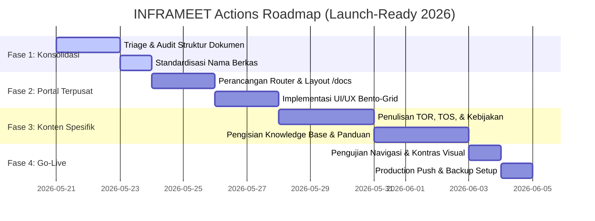

# 🏛️ DOCUMENTATION PORTAL ROADMAP & ACTION PLAN
**Master Plan Pembangunan Portal Dokumentasi Terpusat, Helpdesk, Knowledge Base, dan Kebijakan Legal Khusus Fitur INFRAMEET**  
**Tanggal:** 20 Mei 2026 | **Status:** PROPOSED & READY FOR DESIGN | **Tema:** Deep Space Modernity  

---

## 🧭 SECTION 1: RENCANA TINDAK LANJUT STRATEGIS (ACTION PLAN)

Untuk memastikan peluncuran INFRAMEET berjalan lancar dengan tingkat kesiapan operasional 100%, berikut adalah rencana tindak lanjut terstruktur yang menghubungkan integrasi backend-frontend dengan kelengkapan konten informasi:



### 🗓️ Breakdown Jadwal Eksekusi
1.  **Fase 1: Konsolidasi & Triage Dokumen (Hari 1-3):**
    *   Menggabungkan konten dokumentasi yang tersebar di folder `DOCS-1`, `DOCS-2`, dan `DOCS-3` untuk menghindari redundansi.
    *   Membuat struktur folder terpadu `/ARCHIVE/DOCS_SYSTEM` untuk menampung seluruh naskah tulisan mentah sebelum dirilis ke web.
2.  **Fase 2: Pembangunan Portal Dokumentasi Terpusat (Hari 4-5):**
    *   Membuat layout halaman portal dokumentasi di router Next.js `/docs/page.tsx` dan sub-halaman dinamis `/docs/[category]/[slug]/page.tsx`.
    *   Mendesain UI menggunakan arsitektur bento grid berselubung glassmorphism gelap pekat agar sejalan dengan estetika *Deep Space Modernity*.
3.  **Fase 3: Penulisan Konten Spesifik & Kebijakan Legal (Hari 6-8):**
    *   Menyusun dokumen hukum spesifik (TOR, TOS, Academic Integrity Policy, Escrow Guidelines) untuk masing-masing modul layanan publik dan terdaftar.
    *   Mengisi basis pengetahuan (*Knowledge Base*) untuk membantu penyelesaian kendala teknis pengguna secara mandiri (*self-service support*).
4.  **Fase 4: Uji Coba Estetika & Peluncuran Produksi (Hari 9-10):**
    *   Verifikasi kontras visual teks di setiap halaman dokumentasi agar lolos sertifikasi aksesibilitas WCAG AA (Rasio kontras > 4.5:1).
    *   Melakukan pengerahan kode akhir (*production push*) ke Vercel dan mengatur jadwal cron backup snapshot database mingguan.

---

## 📚 SECTION 2: METODE PENULISAN DOKUMENTASI SPESIFIK FITUR

Masing-masing modul andalan INFRAMEET memerlukan dokumen legal, petunjuk etis, dan panduan operasional khusus untuk melindungi platform dari penyalahgunaan hukum dan memastikan kenyamanan pengguna:

```
┌────────────────────────────────────────────────────────────────────────┐
│                      MODUL FITUR & KEBIJAKAN KHUSUS                    │
├──────────────────────┬──────────────────────────┬──────────────────────┤
│ 1. SUBMISSION PORTAL │ 2. SISTEM ESCROW (REKBER)│ 3. CLAIM DIRECTORY   │
│ - Academic Integrity │ - Escrow TOS             │ - Domain Domain Policy│
│ - Panduan Anti-Joki  │ - Prosedur BAST          │ - Verifikasi Kredensial│
│ - SHA-256 Hashing    │ - Dispute Resolution     │ - Reputasi & Reward  │
└──────────────────────┴──────────────────────────┴──────────────────────┘
```

### 2.1 Modul Pengajuan Proyek (`/submission` & `/api/projects/brief`)
1.  **Academic Integrity & Anti-Jokian Policy (Kebijakan Integritas Ilmiah):**
    *   *Tujuan:* Menjelaskan batas etis layanan INFRAMEET. Menolak tegas segala bentuk pembuatan karya ilmiah ilegal (jasa joki tugas/skripsi).
    *   *Konten Wajib:* Pernyataan kepemilikan data riset etis oleh klien, larangan manipulasi hasil plagiarisme secara ilegal, dan syarat ketaatan hukum akademik nasional.
2.  **Panduan Kriptografis SHA-256 Hashing Dokumen:**
    *   *Tujuan:* Edukasi bagi pengguna publik mengenai teknologi privasi data di sisi client browser.
    *   *Konten Wajib:* Cara kerja kalkulasi hash SHA-256 lokal pada CSV/PDF manifest tanpa mengunggah berkas mentah ke server, menjamin keamanan ide riset sebelum diikat kontrak.

### 2.2 Modul Rekening Bersama & Transaksi Keuangan (`/api/escrow`)
1.  **Escrow Terms of Service (TOS Rekber):**
    *   *Tujuan:* Mengatur syarat pelepasan dana, hak retensi, dan biaya administrasi platform.
    *   *Konten Wajib:* Status dana `held` (ditahan aman) di rekening penampung BCA INFRAMEET, fee platform 5% dari nilai transaksi, dan batas waktu klaim.
2.  **Prosedur Verifikasi BAST (Berita Acara Serah Terima) Kerja:**
    *   *Tujuan:* Memberikan panduan bagi klien korporat untuk memverifikasi pekerjaan sebelum melepaskan dana.
    *   *Konten Wajib:* Daftar centang kendali mutu (*UAT Checklist*), prosedur pengunggahan PDF dokumen BAST bertanda tangan digital, dan pemicu atomik pelepasan dana.
3.  **Kebijakan Penyelesaian Sengketa (Dispute Resolution Policy):**
    *   *Tujuan:* Protokol jika klien atau pakar mengajukan keberatan atas hasil kerja.
    *   *Konten Wajib:* Masa sanggah 3x24 jam setelah draf BAST diunggah, proses mediasi oleh kurator ahli INFRAMEET, dan aturan pembagian dana jika terjadi sengketa (*refund rules*).

### 2.3 Modul Jaringan Pakar & Klaim Profil (`/api/claim` & `/api/experts`)
1.  **Guidelines Verifikasi Kepemilikan Profil Direktori:**
    *   *Tujuan:* Petunjuk langkah demi langkah untuk mengambil alih profil terdaftar.
    *   *Konten Wajib:* Syarat verifikasi OTP berbasis email domain institusi terakreditasi, pencocokan kesesuaian URL situs bisnis dengan domain pengirim email, dan protokol banding jika email ditolak.
2.  **Sistem Penilaian Reputasi & Skema Reward Poin:**
    *   *Tujuan:* Edukasi kalkulasi dynamic trust score berbasis bukti transaksional.
    *   *Konten Wajib:* Bobot kenaikan poin (+15 poin untuk klaim sukses via OTP, +25 poin untuk penyelesaian escrow tanpa sengketa), fungsi RPC kalkulasi otomatis di database, dan manfaat visual lencana terverifikasi (*verified badges*).

---

## 🏛️ SECTION 3: STRUKTUR PORTAL DOKUMENTASI TERPUSAT (`/docs`)

Portal dokumentasi terpusat akan dibangun secara modular dengan navigasi multi-level yang responsif di jalur `/docs`. Portal ini dirancang untuk wewangian premium yang responsif di desktop maupun perangkat mobile.

### 3.1 Peta Situs Navigasi (Sitemap & Hierarchy)
```
/docs
├── 📂 Beranda (Hub Pusat Dokumentasi)
├── 📂 Panduan Pengguna (User Guides)
│   ├── 📝 Cara Mengajukan Brief (/docs/guides/brief-intake)
│   ├── 📝 Cara Menggunakan Kalkulator ROI (/docs/guides/roi-calculator)
│   └── 📝 Alur Pembayaran Escrow BCA (/docs/guides/escrow-payment)
├── 📂 Kebijakan & Legalitas (Policies & Legal)
│   ├── 📝 Syarat & Ketentuan Layanan (/docs/legal/tos)
│   ├── 📝 Academic Integrity Charter (/docs/legal/academic-integrity)
│   └── 📝 Kebijakan Privasi & Enkripsi UU PDP (/docs/legal/privacy-policy)
└── 📂 Portal Pengembang (Developer Portal / API Docs)
    ├── 📝 Autentikasi & Claim API (/docs/dev/claim-api)
    └── 📝 Webhook Webhook Ingestion (/docs/dev/webhook-events)
```

### 3.2 Desain UI/UX & Tampilan Visual (Bento Grid Style)
Halaman utama `/docs` akan menggunakan layout **Bento Grid** interaktif dengan estetika *Deep Space Modernity*:
*   **Hero Search Bar:** Kolom pencarian dinamis dengan latar belakang pendaran aurora ungu (`from-indigo-600/10 to-violet-650/10`) terintegrasi penuh dengan API `/api/search` untuk pencarian instan secepat kilat (*instant search indexing*).
*   **Bento Cards:**
    *   Kartu 1 (2-kolom): *Panduan Integrasi Akademik Bebas Joki* (Latar belakang gelap, aksen garis emerald neon, ikon `ShieldCheck`).
    *   Kartu 2 (1-kolom): *Alur Escrow Terverifikasi* (Aksen garis violet neon, indikator status held/released beranimasi pulse, ikon `Scale`).
    *   Kartu 3 (1-kolom): *Dokumentasi API Kriptografis* (Ikon `FileCode`, blok kode sintaksis modern dengan font monospace Outfit).
    *   Kartu 4 (2-kolom): *Pusat Bantuan & Panduan Cepat FAQ* (Ikon `HelpCircle`).

### 3.3 Penegakan Rasio Kontras Tinggi & Tipografi
*   **Tipografi Judul:** Menggunakan font **Outfit** dengan ketebalan *font-bold* (700/800) dan warna putih salju (`text-white` / `#ffffff`) untuk struktur hierarki visual yang tajam.
*   **Tipografi Teks Tubuh:** Menggunakan font **Inter** dengan ketebalan *font-medium* (400/500) dan warna abu-abu keperakan (`text-slate-300` / `#cbd5e1`) untuk keterbacaan teks esai legal yang panjang dan melelahkan.
*   **Highlight Alert Box:** Menggunakan kontras khusus untuk peringatan hukum (*caution block*):
    ```css
    .alert-caution-high-contrast {
        background-color: rgba(239, 68, 68, 0.08); /* 8% opacity red */
        border: 1px solid rgba(239, 68, 68, 0.4);
        color: #fca5a5; /* Bright pastel red */
    }
    ```

---

*Dengan rencana pembangunan portal terpusat ini, INFRAMEET akan memiliki infrastruktur dokumentasi, edukasi integritas ilmiah, dan hukum perlindungan privasi data tingkat tinggi yang sejajar dengan platform SaaS enterprise berskala global.*
