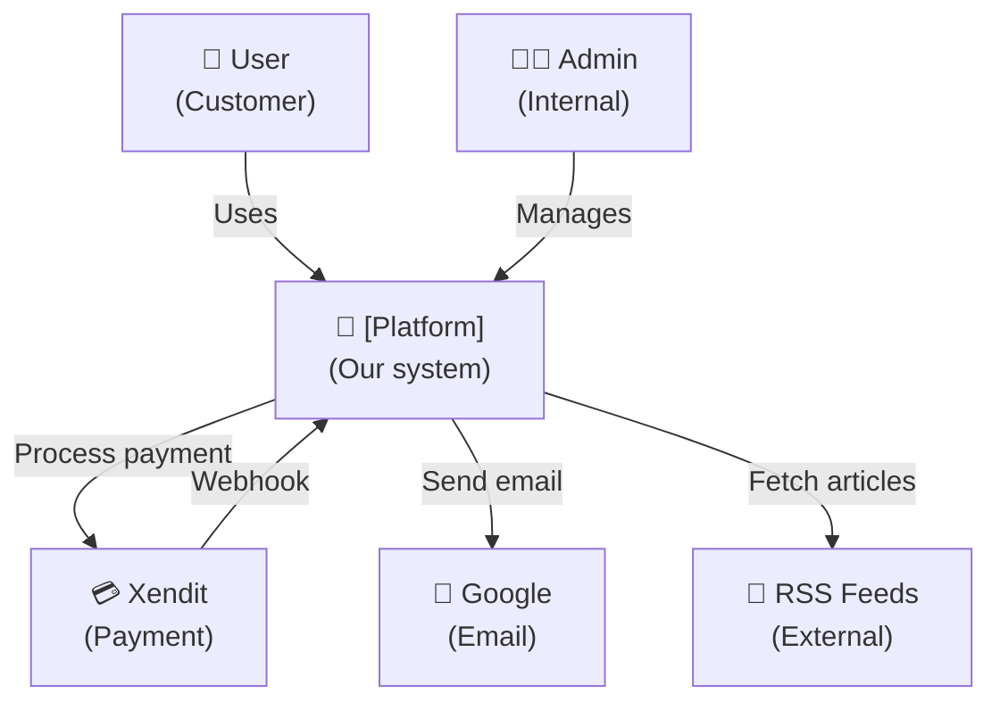
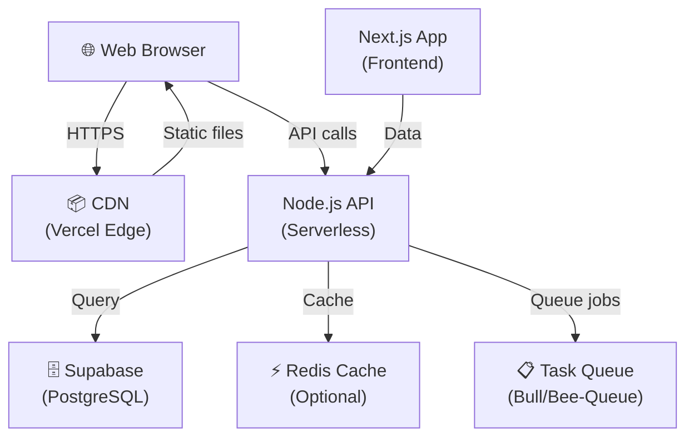
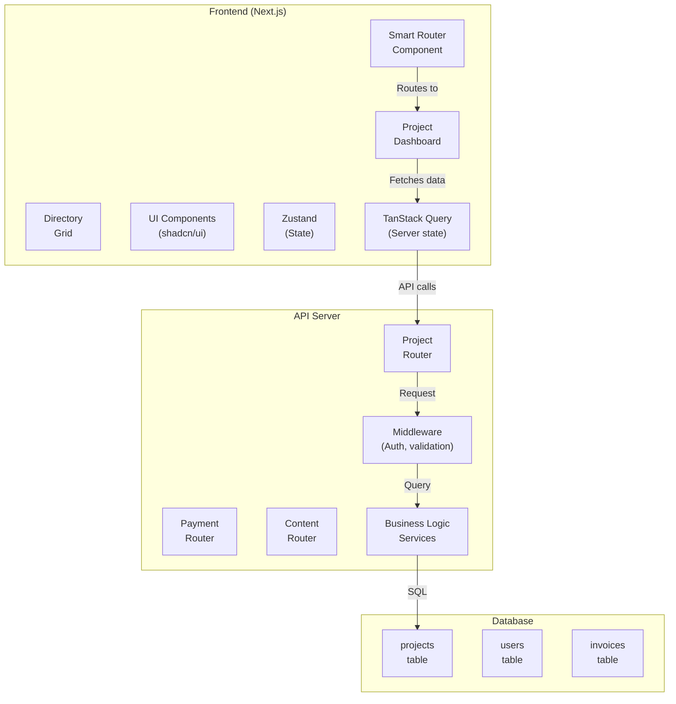
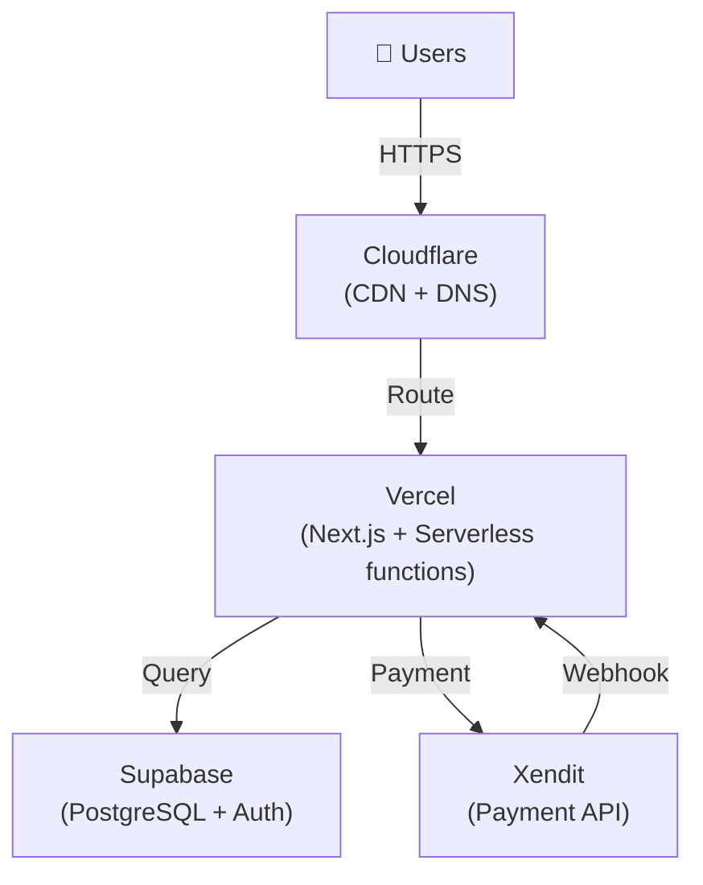
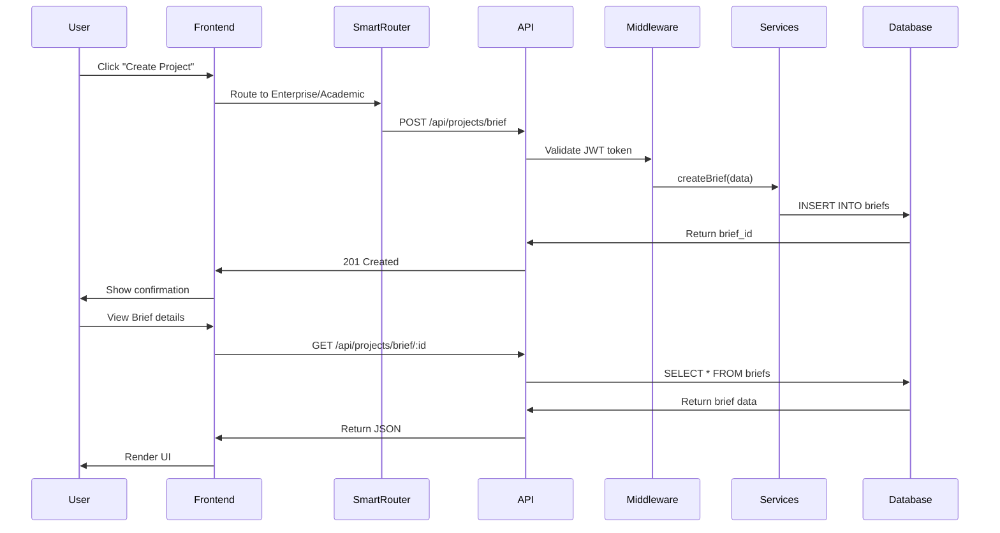

# 🏗️ Professional Documentation Framework & Template Library

**Mitra Infrastruktur & Pertumbuhan Digital Platform**  
**Complete Modular Framework with 25 Document Templates**  
**Date:** May 17, 2026 | Version: 1.0

---

## FRAMEWORK OVERVIEW

This document provides:
1. **Documentation Architecture** — How 25 documents organize into logical categories
2. **Template Library** — Ready-to-use templates for each document type
3. **Modular Structure** — How documents relate to each other
4. **Quality Standards** — What makes documentation "complete"

---

## DOCUMENTATION ARCHITECTURE

### Tier 1: Entry Points (Users start here)
```
User Role → Choose Path → Quick Reference → Links to relevant docs

Founder/CEO        → QUICK_REFERENCE.md (role: founder)
Developer          → QUICK_REFERENCE.md (role: developer)
PM/Product Manager → QUICK_REFERENCE.md (role: product)
DevOps/SRE         → QUICK_REFERENCE.md (role: infrastructure)
Legal/Compliance   → QUICK_REFERENCE.md (role: legal)
Operations/Support → QUICK_REFERENCE.md (role: operations)
```

### Tier 2: Category Hubs (Deep-dive by domain)
```
Strategic & Business   ← WHITEPAPER.md ← BUSINESS_MODEL_CANVAS.md
                       ← MARKET_ANALYSIS.md ← BRAND_GUIDELINES.md

Legal & Compliance     ← TERMS_AND_POLICIES.md ← PRIVACY_COMPLIANCE.md
                       ← SLA_FRAMEWORK.md

Technical Architecture ← ARCHITECTURE_C4_MODEL.md ← GITHUB_REPO_STRUCTURE.md
                       ← API_SPECIFICATION.md ← DATABASE_SCHEMA.md
                       ← DEPLOYMENT_GUIDE.md

Advanced Architecture  ← SECURITY_ARCHITECTURE.md ← DISASTER_RECOVERY.md
                       ← OBSERVABILITY_STRATEGY.md ← TESTING_STRATEGY.md
                       ← PERFORMANCE_OPTIMIZATION.md

Operations & Runbooks  ← MASTER_CHECKLIST.md ← DEVELOPER_ONBOARDING.md
                       ← OPERATIONS_RUNBOOK.md ← INCIDENT_RESPONSE_PLAYBOOK.md

Product Specification  ← PRODUCT_SPECIFICATION.md (merged dashboard docs)
                       ← LEGAL_OPERATIONS_TEMPLATES.md
                       ← ADVANCED_FEATURES_GUIDE.md

Standards & Guidelines ← DOCUMENTATION_STYLE_GUIDE.md ← CONTRIBUTING_GUIDE.md
                       ← GLOSSARY_AND_FAQ.md
```

### Tier 3: Cross-References
All documents link back to:
- `MASTER-INDEX.md` — Navigation hub
- `GLOSSARY_AND_FAQ.md` — Terminology & troubleshooting
- Relevant specification documents

---

## DOCUMENT TEMPLATES (25 TOTAL)

### 🎯 STRATEGIC & BUSINESS DOCUMENTS (4)

#### 1️⃣ WHITEPAPER.md
**Purpose:** Executive-level platform overview  
**Audience:** Founders, investors, product leaders  
**Length:** 5-8 KB | **Time to Read:** 10-15 min

**Template:**
```markdown
# Whitepaper: [Platform Name]

**Version:** 1.0 | **Date:** [DATE] | **Status:** PUBLISHED

---

## Executive Summary (1 paragraph)
[Hook + problem + solution + market opportunity]

## 1. Problem Statement (300-400 words)
### The Market Pain Point
- Current state of industry
- Customer frustration
- Market gaps

### Why Existing Solutions Fail
- Limitation 1
- Limitation 2
- Limitation 3

## 2. Our Solution (500-600 words)
### Overview
[High-level approach]

### Key Differentiators
1. [Unique feature 1 + why it matters]
2. [Unique feature 2 + why it matters]
3. [Unique feature 3 + why it matters]

### Technical Architecture (high-level)
[Diagram or description of how it works]

### How It Creates Value
[ROI breakdown or value prop demonstration]

## 3. Market Opportunity
### Total Addressable Market (TAM)
- Market size: [$ amount]
- Growth rate: [% CAGR]
- Timeline: [years]

### Serviceable Available Market (SAM)
[Realistic subset of TAM we target]

### Serviceable Obtainable Market (SOM)
[What we can realistically capture in 3-5 years]

## 4. Business Model
### Revenue Streams
1. [Stream 1 + pricing]
2. [Stream 2 + pricing]
3. [Stream 3 + pricing]

### Unit Economics (Year 1)
| Metric | Amount |
|--------|--------|
| Average Contract Value (ACV) | $ |
| Customer Acquisition Cost (CAC) | $ |
| Lifetime Value (LTV) | $ |
| LTV:CAC Ratio | X:1 |

## 5. Go-to-Market Strategy
### Phase 1: Launch (Months 1-3)
- Primary channel: [channel]
- Target segment: [segment]
- Success metric: [metric]

### Phase 2: Growth (Months 4-9)
[Channel 2, segment 2, metric 2]

### Phase 3: Scale (Months 10-18)
[Channel 3, segment 3, metric 3]

## 6. Competitive Landscape
### Direct Competitors
| Competitor | Strength | Weakness | Our Advantage |
|------------|----------|----------|---------------|
| [Comp 1] | | | |
| [Comp 2] | | | |

### Competitive Moat
[What makes us defensible long-term]

## 7. Team & Execution Capability
### Key Team Members
- [Name]: [Role + 1-line background]
- [Name]: [Role + 1-line background]

### Why We'll Win
[Founder insight, market timing, team expertise]

## 8. Financial Projections (3-Year)
| Year | Revenue | Gross Margin | Operating Margin |
|------|---------|--------------|------------------|
| Year 1 | $ | % | % |
| Year 2 | $ | % | % |
| Year 3 | $ | % | % |

## 9. Investment Ask (if applicable)
### Funding Round
- Amount: $[amount]
- Use of funds: [breakdown]
- Timeline: [when]

### Return Expectations
[ROI multiple, exit strategy]

## 10. Roadmap & Milestones
### Q1: [Milestone]
### Q2: [Milestone]
### Q3: [Milestone]
### Q4: [Milestone]

## Conclusion
[Vision statement + call to action]

## Appendix
- [Data sources]
- [Detailed financial model]
- [Market research references]

---

**Document Owner:** [Name]  
**Last Reviewed:** [Date]  
**Next Review:** [3 months later]
```

---

#### 2️⃣ BUSINESS_MODEL_CANVAS.md
**Purpose:** One-page visual business model  
**Audience:** All stakeholders  
**Length:** 3-4 KB | **Time to Read:** 5 min

**Template:**
```markdown
# Business Model Canvas

**Platform:** [Name] | **Version:** 1.0 | **Date:** [DATE]

---

## 1. Customer Segments
### Segment A: [Name]
- Characteristics: [size, geography, needs]
- Market size: [#]
- Pain points: [list 3]

### Segment B: [Name]
[Similar structure]

## 2. Value Propositions
### For Segment A
- [Value 1]
- [Value 2]
- [Value 3]

### For Segment B
[Similar]

## 3. Channels
### Acquisition
- [Channel 1: how do we reach them?]
- [Channel 2]
- [Channel 3]

### Delivery
- [How do they use it?]

### Support
- [Support channels]

## 4. Customer Relationships
- [Type 1: self-service, community, dedicated support]
- [Type 2]

## 5. Revenue Streams
### Stream A: [Name]
- Price model: [fixed, variable, freemium]
- Price point: [$]
- Expected volume: [#/month]
- Annual revenue: [$]

### Stream B: [Name]
[Similar structure]

### Total Projected Monthly Revenue
[$]

## 6. Key Resources
### Human
- [Founder/CEO: expertise]
- [CTO/Tech Lead: expertise]
- [Partnerships needed]

### Technology
- [Tech stack key items]
- [Infrastructure]

### Financial
- [Runway/funding]
- [Cost per acquisition target]

## 7. Key Activities
- [Activity 1: e.g., "Customer acquisition"]
- [Activity 2: e.g., "Product development"]
- [Activity 3: e.g., "Operations & support"]

## 8. Key Partnerships
- [Partner 1: role, benefit]
- [Partner 2]
- [Partner 3]

## 9. Cost Structure
| Category | Monthly Cost | Annual Cost |
|----------|--------------|-------------|
| Infrastructure | $ | $ |
| Personnel | $ | $ |
| Marketing & Sales | $ | $ |
| Operations | $ | $ |
| **Total** | **$** | **$** |

### Profitability Analysis
- Monthly burn rate: $[amount]
- Breakeven revenue: $[amount]
- Months to profitability: [#]

---

## Visual Canvas (ASCII or link to Miro/FigJam)

```
[Optional: ASCII art or embedded image of traditional BMC layout]
```

---

**Canvas Owner:** [Name]  
**Last Updated:** [Date]  
**Review Cadence:** Monthly
```

---

#### 3️⃣ BRAND_GUIDELINES.md
**Purpose:** Brand identity, tone, visual standards  
**Audience:** Marketing, design, content team  
**Length:** 4-5 KB | **Time to Read:** 8 min

**Template:**
```markdown
# Brand Guidelines

**Platform:** [Name] | **Version:** 1.0 | **Date:** [DATE]

---

## 1. Brand Essence

### Mission
[One sentence purpose]

### Vision
[Where we want to be in 5 years]

### Core Values
1. [Value 1] — [1-sentence description]
2. [Value 2] — [1-sentence description]
3. [Value 3] — [1-sentence description]
4. [Value 4] — [1-sentence description]

### Brand Positioning
**We are the [category] for [audience] that [unique benefit] because [reason to believe].**

### Brand Personality
[Adjective list: e.g., "Trustworthy, innovative, accessible, professional"]

## 2. Visual Identity

### Logo
- Primary logo: [description or link]
- Logo usage: [do's and don'ts]
- Minimum size: [dimensions]
- Clear space: [measurements]

### Color Palette
#### Primary Colors
| Color | Hex | RGB | Usage |
|-------|-----|-----|-------|
| Brand Blue | #0066FF | rgb(0, 102, 255) | Primary UI, buttons, headers |
| Brand Accent | #FF6B35 | rgb(255, 107, 53) | CTAs, highlights, alerts |

#### Secondary Colors
[Similar structure for secondary palette]

#### Neutral Colors
| Gray 50 | #F9FAFB | rgb(249, 250, 251) | Backgrounds |
| Gray 900 | #111827 | rgb(17, 24, 39) | Text |

### Typography
#### Primary Font: [Name] (for headings)
- Font family: [foundry]
- Weights: 600, 700, 800
- Usage: H1, H2, H3, marketing headlines

#### Secondary Font: [Name] (for body)
- Font family: [foundry]
- Weights: 400, 500, 600
- Usage: Body text, UI labels, forms

#### Font Sizing Scale
| Element | Size | Weight | Line Height |
|---------|------|--------|-------------|
| H1 | 32px | 700 | 1.2 |
| H2 | 24px | 600 | 1.3 |
| H3 | 18px | 600 | 1.4 |
| Body | 16px | 400 | 1.6 |
| Small | 14px | 400 | 1.5 |

### Spacing & Layout
- Base unit: 8px
- Container width: 1440px
- Gutter: 16px
- Common spacings: 8px, 16px, 24px, 32px, 48px, 64px

### Imagery Style
- Photography style: [e.g., "Clean, minimal, bright lighting"]
- Illustration style: [e.g., "Modern, geometric, colorful"]
- Icons: [style guide]

## 3. Tone of Voice

### Tone Attributes
| Attribute | Description | Example |
|-----------|-------------|---------|
| Professional | Credible, knowledgeable | "Our platform uses enterprise-grade security" |
| Accessible | Clear, jargon-free | "Simple contracts that don't require a lawyer" |
| Empathetic | Understands user pain | "We know contracts are confusing—we fixed it" |

### Voice Guidelines
### ✅ DO:
- Use simple, clear language
- Use "you" and "we" (conversational)
- Use active voice
- Be specific and concrete
- Use short sentences
- Use contractions (don't, it's, we're)

### ❌ DON'T:
- Use corporate jargon
- Use passive voice ("It was determined...")
- Be vague ("Some users say...")
- Use long, complex sentences
- Overuse exclamation marks
- Use ALL CAPS (except acronyms)

### Copy Examples
#### Welcome Message
✅ GOOD: "Welcome to [Platform]. Let's build something great together."  
❌ BAD: "The [Platform] ecosystem facilitates optimal stakeholder synergy."

#### Error Message
✅ GOOD: "Oops! We couldn't save that. Try again?"  
❌ BAD: "Error 500: Internal Server Error. Please contact administrator."

#### CTA Button
✅ GOOD: "Create Your First Project"  
❌ BAD: "Submit"

## 4. Brand Applications

### Website Header
[Logo size, nav layout, color usage]

### Email Templates
[Header, footer, color usage, CTA styling]

### Social Media
- Profile image: [size, format]
- Cover image: [size, format]
- Post format: [dimensions, frequency]
- Hashtag strategy: [brand hashtags]

### Marketing Collateral
- Slide deck template: [link]
- PDF template: [link]
- Infographic style: [guidelines]

### Dashboard/Product UI
- Component styling: [Tailwind/design system link]
- Icon set: [Lucide, Heroicons, etc.]
- Interaction patterns: [subtle animations, transitions]

## 5. Dos and Don'ts

### Visual Dos and Don'ts
| ✅ DO | ❌ DON'T |
|------|---------|
| Use brand colors intentionally | Use random color variations |
| Maintain consistent spacing | Mix spacing systems |
| Use brand fonts exclusively | Mix fonts randomly |

### Content Dos and Don'ts
| ✅ DO | ❌ DON'T |
|------|---------|
| Proofread everything | Publish without review |
| Use active voice | Use passive voice |
| Be specific | Be vague |

## 6. Brand Resources

- [Logo files (PNG, SVG, EPS)]
- [Brand colors library (.aco, .json)]
- [Typography library (ttf, woff)]
- [Design system / component library]
- [Figma brand kit]
- [Brand assets repository]

---

**Brand Owner:** [Name]  
**Last Updated:** [Date]  
**Review Cadence:** Quarterly  
**Approval Required:** CEO, CMO
```

---

#### 4️⃣ MARKET_ANALYSIS.md
**Purpose:** Competitive analysis, TAM, pricing strategy  
**Audience:** Executive, product, sales  
**Length:** 6-8 KB | **Time to Read:** 15 min

**Template:**
```markdown
# Market Analysis & Competitive Intelligence

**Platform:** [Name] | **Date:** [DATE] | **Data Cutoff:** [DATE]

---

## 1. Market Overview

### Industry Definition
[Definition of market we're in]

### Market Size & Growth
- Current market size: $[amount] (2026)
- Projected growth: [%] CAGR (2026-2031)
- Key growth drivers: [driver 1, driver 2, driver 3]
- Regional breakdown: [US %, APAC %, etc.]

### Market Trends
1. [Trend 1] — [Impact on our positioning]
2. [Trend 2] — [Impact on our positioning]
3. [Trend 3] — [Impact on our positioning]

## 2. Customer Segmentation

### Primary Segment: [Name]
| Attribute | Details |
|-----------|---------|
| Size | [# of businesses/users] |
| Geographic focus | [regions] |
| Key pain points | [list] |
| Buying criteria | [list] |
| Budget authority | [who decides] |
| Sales cycle | [weeks/months] |

### Secondary Segment: [Name]
[Similar structure]

### Tertiary Segment: [Name]
[Similar structure]

## 3. Customer Needs Analysis

### Segment A: [Name]
| Need | Importance | Current Solution | Our Solution |
|------|-----------|------------------|--------------|
| [Need 1] | High | [Current approach] | [How we solve] |
| [Need 2] | Medium | [Current approach] | [How we solve] |

### Segment B: [Name]
[Similar structure]

## 4. Competitive Landscape

### Direct Competitors

#### Competitor 1: [Name]
| Attribute | Details |
|-----------|---------|
| Founded | [Year] |
| Headquarters | [Location] |
| Funding raised | [$] |
| Pricing | [model and price point] |
| Market position | [leader, challenger, niche] |
| Strengths | [list] |
| Weaknesses | [list] |
| Customer base | [segment 1, segment 2] |

#### Competitor 2: [Name]
[Similar structure]

#### Competitor 3: [Name]
[Similar structure]

### Competitive Matrix
```
         Price
         Low        High
        ┌──────────────────┐
        │    Competitor 1  │
  High  │   (our target)   │
Quality ├──────────────────┤
        │ Competitor 2     │
  Low   │  Competitor 3    │
        └──────────────────┘
```

### Indirect Competitors (Alternative solutions)
- [Solution 1] — [market share %, why people choose it]
- [Solution 2] — [market share %, why people choose it]

## 5. Our Competitive Advantage

### Key Differentiators
| Feature/Capability | Us | Comp 1 | Comp 2 | Comp 3 |
|-------------------|----|---------|---------|----|
| [Feature 1] | ✅ | ✅ | ❌ | ✅ |
| [Feature 2] | ✅ | ❌ | ✅ | ❌ |
| [Feature 3] | ✅ | ❌ | ❌ | ❌ |

### Competitive Moat (Long-term defensibility)
1. [Moat 1: e.g., "Network effects, switching costs, brand loyalty"]
2. [Moat 2]
3. [Moat 3]

## 6. Pricing Strategy

### Market Pricing Benchmarks
| Competitor | Pricing Model | Entry Price | High-End Price |
|-------------|---------------|-------------|----------------|
| [Comp 1] | [SaaS, Freemium, etc.] | $ | $ |
| [Comp 2] | | $ | $ |

### Our Pricing Strategy
### Tier 1: Starter
- Price: $[amount]/month
- Included features: [list]
- Target: [segment]

### Tier 2: Professional
- Price: $[amount]/month
- Included features: [list]
- Target: [segment]

### Tier 3: Enterprise
- Price: Custom (average $[amount])
- Included features: [list]
- Target: [segment]

### Pricing Rationale
[Why these price points, how they compare to competitors]

## 7. Go-to-Market Considerations

### Sales Channel Strategy
- Self-serve web: [target segment]
- Direct sales: [target segment]
- Partnerships: [partnership opportunities]

### Marketing Channel Effectiveness
| Channel | Estimated CAC | Conversion Rate | LTV Projection |
|---------|--------------|-----------------|----------------|
| [Channel 1] | $ | [%] | $[amount] |
| [Channel 2] | $ | [%] | $[amount] |

## 8. Market Risks & Mitigation

| Risk | Impact | Probability | Mitigation |
|------|--------|-------------|-----------|
| [Risk 1] | High | Medium | [Mitigation strategy] |
| [Risk 2] | Medium | High | [Mitigation strategy] |

## 9. Opportunity Assessment

### Market Entry Strategy
- Timing: [why now is the right time]
- Initial beachhead: [which segment to win first]
- Growth trajectory: [how to expand]

### Expansion Opportunities
1. [Adjacent market 1]
2. [Adjacent market 2]
3. [International expansion]

## 10. References & Data Sources

- [Source 1 — data point]
- [Source 2 — data point]
- [Industry reports]
- [Analyst firms: Gartner, IDC, etc.]
- [Customer research: interviews, surveys]

---

**Analyst:** [Name]  
**Last Updated:** [Date]  
**Review Cadence:** Quarterly  
**Data Sources:** [List of primary sources]
```

---

### ⚖️ LEGAL & COMPLIANCE DOCUMENTS (3)

#### 5️⃣ TERMS_AND_POLICIES.md
**Purpose:** ToS, AUP, refund policy  
**Audience:** All users, legal review  
**Length:** 8-10 KB | **Time to Read:** 20 min

**Template Structure:**
```markdown
# Terms of Service, Acceptable Use Policy & Refund Terms

**Platform:** [Name] | **Effective Date:** [DATE] | **Version:** 1.0

---

## TABLE OF CONTENTS
1. Terms of Service
2. Acceptable Use Policy
3. Refund & Cancellation Policy
4. Limitation of Liability
5. Contact & Dispute Resolution

---

## 1. TERMS OF SERVICE

### 1.1 Acceptance of Terms
By accessing or using [Platform], you agree to be bound by these Terms of Service...

### 1.2 User Accounts
- You are responsible for maintaining confidentiality of your password
- You agree to provide accurate information
- You are responsible for all activities under your account
- You must not share your account with others

### 1.3 User Responsibilities
You agree not to:
- Use the platform for illegal purposes
- Interfere with platform security or integrity
- Reverse engineer, decompile, or disassemble the platform
- Transmit malware or harmful code
- Collect or scrape user data without consent
- Impersonate other users
- Harass, abuse, or threaten other users

### 1.4 Intellectual Property
[Define what content users own vs. platform owns]
[License grants for user content]

### 1.5 Payment Terms
- Billing cycles: [monthly, annual, etc.]
- Payment methods accepted: [list]
- Price changes: [30 days notice]
- Failed payments: [suspension procedures]

### 1.6 Limitation of Liability
[Legal language on what you're NOT liable for]

### 1.7 Dispute Resolution
[Arbitration clause, jurisdiction, governing law]

---

## 2. ACCEPTABLE USE POLICY

### 2.1 Prohibited Uses
You agree NOT to:

#### Illegal Activity
- Use platform for illegal purposes
- Violate any applicable laws or regulations

#### Fraud & Deception
- Misrepresent yourself or your affiliation
- Phishing, social engineering attempts
- Create fake accounts or credentials

#### Abuse & Harassment
- Harass, threaten, or abuse other users
- Doxing or publishing private information
- Spam, bulk messaging

#### Security Violations
- Attempt unauthorized access
- Disrupt platform availability (DDoS)
- Exploit security vulnerabilities
- Distribute malware

#### Content Violations
- Share illegal content (CSAM, etc.)
- Copyright infringement
- Hate speech or discrimination
- Misinformation that causes harm

### 2.2 Monitoring & Enforcement
- We monitor for abuse and violations
- Violations may result in account suspension or termination
- We may cooperate with law enforcement
- We reserve the right to refuse service

### 2.3 User-Generated Content
[Responsibility for user content, rights to moderate/remove]

---

## 3. REFUND & CANCELLATION POLICY

### 3.1 Refund Policy
#### 30-Day Money-Back Guarantee (if applicable)
- If you're not satisfied within 30 days, full refund
- No questions asked
- Must request within 30 days of purchase

#### Partial Refunds
[Conditions under which partial refunds apply]

#### Non-Refundable Items
- Custom development or professional services
- Services already delivered or used
- Discounted or promotional pricing

### 3.2 Cancellation Policy
#### How to Cancel
- Log in to dashboard → Settings → Cancel Subscription
- Or email support@[domain] with cancellation request

#### When Cancellation Takes Effect
- End of current billing cycle
- No refund for current month
- Access revoked after period ends

#### Data Retention After Cancellation
- Data retained for [period, e.g., 30 days]
- Can request data export before deletion
- No recovery possible after deletion

### 3.3 Refund Process
- Request submitted within refund window
- Processing time: [5-7 business days]
- Refund issued to original payment method

---

## 4. LIMITATION OF LIABILITY

[Standard legal language limiting liability for damages]
- We provide service "as is"
- We're not liable for indirect, consequential damages
- Liability capped at amount you paid
- Some jurisdictions don't allow liability limits

---

## 5. CONTACT & DISPUTE RESOLUTION

### Contact Information
- **Email:** legal@[domain]
- **Mailing Address:** [Full address]
- **Support Portal:** [URL]

### Dispute Resolution Process
1. Contact us with complaint
2. We respond within [days]
3. If unresolved, proceed to arbitration
4. Governing law: [jurisdiction]

---

**Legal Review:** [Date]  
**Next Review:** [Date + 12 months]  
**Approved By:** [Name, Title]
```

---

#### 6️⃣ PRIVACY_COMPLIANCE.md
**Purpose:** Privacy policy, GDPR/IDPR, Data Processing Agreement  
**Audience:** All users, compliance officers  
**Length:** 10-12 KB | **Time to Read:** 25 min

**Template Structure:**
```markdown
# Privacy Policy & Compliance Framework

**Platform:** [Name] | **Effective Date:** [DATE] | **Version:** 1.0

---

## TABLE OF CONTENTS
1. Privacy Policy
2. GDPR Compliance
3. IDPR (Indonesian Data Protection) Compliance
4. Data Processing Agreement
5. Cookie Policy

---

## 1. PRIVACY POLICY

### 1.1 Introduction
We are committed to protecting your privacy. This Policy explains how we collect, use, and protect your personal information.

### 1.2 Data We Collect

#### Information You Provide Directly
- Name, email, phone number
- Company/organization information
- Payment information
- Support messages and communications
- Document uploads and project data

#### Information Collected Automatically
- IP address and browser information
- Page views and click patterns (Google Analytics)
- Device type and operating system
- Referral source
- Login times and activity logs

#### Third-Party Data
- Payment processor (Stripe, Xendit, etc.)
- Verification services (e.g., identity verification)
- Social media (if you sign in via social)

### 1.3 How We Use Your Data

| Purpose | Legal Basis | Retention |
|---------|------------|-----------|
| Provide services | Contract performance | Duration of contract |
| Customer support | Legitimate interest | Until case closed + 1 year |
| Product improvements | Legitimate interest | Until no longer needed |
| Marketing (with consent) | Consent | Until withdrawn |
| Legal compliance | Legal obligation | Required retention period |
| Fraud prevention | Legitimate interest | 3 years |

### 1.4 Data Sharing
We share your data with:
- **Service providers:** Cloud hosting (Supabase), payment processors (Xendit), analytics (Google)
- **Legal requirements:** If required by law or court order
- **Consent:** Only when you explicitly consent

We do NOT:
- Sell your personal data
- Share with marketing partners without consent
- Share with competitors

### 1.5 Data Security
- SSL/TLS encryption in transit
- AES-256 encryption at rest
- Access controls and authentication
- Regular security audits
- Incident response procedures

### 1.6 Your Rights
You have the right to:
- **Access:** Get a copy of your data
- **Correction:** Update inaccurate data
- **Deletion:** Request data deletion (right to be forgotten)
- **Portability:** Export your data in machine-readable format
- **Opt-out:** Stop marketing communications
- **Object:** Opt-out of certain processing

### 1.7 Data Retention
[Specific retention periods for different data types]
- User account data: Retained until account deleted
- Transaction records: 7 years (tax/legal requirement)
- Support tickets: 3 years
- Analytics data: 26 months (Google Analytics default)
- Backups: 30 days

---

## 2. GDPR COMPLIANCE

### 2.1 Applicability
This applies to personal data of EU residents under GDPR.

### 2.2 Legal Basis for Processing
- **Contract:** Necessary to provide services
- **Consent:** Marketing, optional features
- **Legal obligation:** Tax, anti-fraud
- **Legitimate interest:** Service improvement, security

### 2.3 Data Subject Rights (GDPR Articles 12-22)
- Right of access (Article 15)
- Right to rectification (Article 16)
- Right to erasure (Article 17)
- Right to restrict processing (Article 18)
- Right to data portability (Article 20)
- Right to object (Article 21)
- Rights related to automated decision-making (Article 22)

### 2.4 How to Exercise Rights
- Email: privacy@[domain]
- Response time: 30 days (may extend by 60 days for complex requests)
- Verification: We may request proof of identity

### 2.5 Data Processing Agreement
[Link to separate DPA document]
- Available upon request
- Includes Standard Contractual Clauses (SCCs) for transfers
- Sub-processors list: [link]

### 2.6 International Data Transfers
- Data transferred using Standard Contractual Clauses (SCCs)
- Adequacy Decisions: [applicable jurisdictions]
- Binding Corporate Rules: [if applicable]

### 2.7 Data Protection Impact Assessment (DPIA)
[Available for high-risk processing - link if applicable]

### 2.8 Data Breach Notification
- We notify affected individuals within 72 hours
- Details: [data involved, potential risks, recommended actions]
- Authority notification: [EU Supervisory Authorities]

---

## 3. IDPR (INDONESIAN DATA PROTECTION) COMPLIANCE

### 3.1 Applicability
This applies to personal data of Indonesian residents under Law No. 27 of 2022 (PDP Law).

### 3.2 Principles
- Lawfulness, openness, accuracy, security
- Purpose limitation
- Data minimization

### 3.3 Legal Basis (Required by IDPR Article 5)
- **Consent:** Explicit opt-in
- **Legal obligation:** Tax, regulatory
- **Contract performance:** Necessary for services
- **Vital interests:** Life/health protection

### 3.4 Individual Rights (IDPR Chapter VI)
- Right of access
- Right of correction and completion
- Right to deletion
- Right to export data
- Right to obtain information about third parties
- Right to withdraw consent

### 3.5 How to Exercise Rights
- Email: privacy@[domain]
- Response time: 30 days
- Verification: May request identity confirmation

### 3.6 Data Security Requirements
- Encryption (in transit and at rest)
- Access controls
- Security testing
- Incident response plan
- Data protection officer (if applicable)

### 3.7 Data Localization
- Personal data of Indonesian residents may be stored in Indonesia or abroad
- With sufficient security measures
- [Our current storage: Supabase data centers in [region]]

### 3.8 Government Data Requests
- We follow legal procedures
- Requests must be authorized by legal authority
- We may contest improper requests
- We notify individuals of government access when permitted

---

## 4. DATA PROCESSING AGREEMENT

### 4.1 Introduction
This DPA applies where we process personal data on behalf of a customer.

### 4.2 Roles
- **Data Controller:** Customer (determines purposes/means)
- **Data Processor:** [Platform] (processes on your behalf)

### 4.3 Processing Instructions
We process data only:
- As instructed by you
- To the extent necessary for service delivery
- As authorized in the Terms of Service

### 4.4 Sub-Processors
Current sub-processors:
- Supabase (cloud database) — [country]
- Stripe/Xendit (payment) — [country]
- SendGrid (email) — [country]
- Google Analytics (analytics) — [country]

You can view full [sub-processors list] and object to sub-processors.

### 4.5 Data Subject Rights
Customer is responsible for fulfilling individual rights requests.
We assist by:
- Providing requested data
- Marking data for correction
- Deleting data upon request

### 4.6 Confidentiality
- Only authorized personnel access data
- All personnel sign confidentiality agreements
- [Details of security measures]

### 4.7 Return or Deletion of Data
Upon termination:
- Option 1: Return your data (data export)
- Option 2: Secure deletion of your data
- [Timeline and procedures]

### 4.8 Audit & Compliance
- Right to audit our security measures
- We provide attestations/certifications
- [SOC 2 Type II, ISO 27001, etc.]

---

## 5. COOKIE POLICY

### 5.1 What Are Cookies?
Small files stored on your browser that help us recognize you.

### 5.2 Cookies We Use

| Cookie Name | Purpose | Duration | Type |
|-------------|---------|----------|------|
| session_id | Keep you logged in | Until logout | Essential |
| csrf_token | Security | Session | Essential |
| _ga | Google Analytics | 2 years | Analytics |
| utm_* | Campaign tracking | Session | Marketing |

### 5.3 Cookie Consent
- Essential cookies: No consent needed
- Analytics/Marketing: Require consent (cookie banner)
- Consent mechanism: [Cookie preference center]

### 5.4 Manage Cookies
- Browser settings: [How to disable cookies]
- Our preference center: [Link]
- Opt-out of analytics: [Link]

---

## 6. CONTACT & COMPLAINTS

### Data Protection Officer
- **Email:** dpo@[domain]
- **Response time:** [days]

### EU Supervisory Authority
- [Link to relevant EU DPA]

### Indonesian Supervisory Authority
- Office of the Deputy for Coordination of Governance Issues
- [Contact details]

---

**Last Updated:** [Date]  
**Next Review:** [Date]  
**Approved By:** [Name, Legal Title]  
**DPO:** [Name, contact]
```

---

#### 7️⃣ SLA_FRAMEWORK.md
**Purpose:** Service Level Agreements, guarantees, support SLA  
**Audience:** Customers, support team, operations  
**Length:** 4-5 KB | **Time to Read:** 10 min

**Template Structure:**
```markdown
# Service Level Agreement (SLA) Framework

**Platform:** [Name] | **Effective Date:** [DATE] | **Version:** 1.0

---

## 1. SERVICE AVAILABILITY SLA

### Uptime Guarantee
**99.5% uptime per calendar month**

| Percentage | Downtime (monthly) | Credit |
|-----------|------------------|--------|
| ≥ 99.5% | ≤ 3.6 hours | 0% credit |
| 99.0% - 99.49% | 3.6 - 7.2 hours | 5% of monthly fee |
| 98.0% - 98.99% | 7.2 - 14.4 hours | 10% of monthly fee |
| < 98.0% | > 14.4 hours | 25% of monthly fee |

### Exclusions (Don't count toward SLA)
- Scheduled maintenance (with 72-hour notice)
- Customer-caused outages (misconfiguration)
- Internet service provider failures
- Force majeure events
- DDoS attacks (if unmitigated)

### Measurement
- Uptime measured from external monitoring
- 5-minute check intervals
- [Monitoring tool: e.g., StatusPage.io]

---

## 2. SUPPORT SLA

### Support Channels
- **Email:** support@[domain]
- **Chat:** In-app support (business hours)
- **Phone:** Enterprise plans only

### Response Time Guarantees

| Severity | Definition | Target Response | Target Resolution |
|----------|-----------|-----------------|-------------------|
| Critical (P1) | Complete service outage, data loss risk | 1 hour | 4 hours |
| High (P2) | Significant functionality degraded | 4 hours | 24 hours |
| Medium (P3) | Minor issue, workaround exists | 24 hours | 72 hours |
| Low (P4) | Feature request, documentation | 5 business days | No target |

### Support Hours
- **Standard:** M-F, 9 AM - 5 PM (your timezone) UTC+7
- **Enterprise:** 24/7/365 (Premium add-on)

### Coverage
- All customers: Email support
- Business+ plans: Priority support, 4-hour response
- Enterprise: Dedicated support engineer, 1-hour response

---

## 3. PERFORMANCE GUARANTEES

### API Performance
- **API latency:** 95th percentile < 200ms
- **Error rate:** < 0.1%
- **Rate limits:** [Varies by plan]

### Page Load Performance
- **Core Web Vitals:** LCP < 2.5s, FID < 100ms, CLS < 0.1
- **Page load time:** < 3 seconds (95th percentile)

---

## 4. DATA PROTECTION & SECURITY

### Backup & Recovery
- **Backup frequency:** Daily (automated)
- **Retention:** 30 days of backups
- **RTO (Recovery Time Objective):** < 4 hours
- **RPO (Recovery Point Objective):** < 24 hours

### Data Encryption
- **In transit:** TLS 1.2+
- **At rest:** AES-256 encryption
- **Key management:** [Details]

### Security Incident Response
- **Detection:** Within 1 hour (automated)
- **Notification:** Within 24 hours (if personal data affected)
- **Investigation:** Begin within 4 hours
- **Public disclosure:** Transparent communication

---

## 5. CREDITS & REMEDIES

### Service Credits
- Applied automatically to next billing cycle
- Sole remedy for SLA violations
- Does not prevent cancellation

### How to Request Credit
- Automatic detection for uptime SLAs
- Email support@[domain] for other issues
- Include: dates, times, impact description
- Request must be made within 30 days

### Example Calculation
- Monthly fee: $1,000
- Uptime: 98.5% (violated SLA)
- Credit: 10% × $1,000 = $100

---

## 6. TERMINATION & REFUNDS

### Termination for SLA Violations
- If < 98% uptime for 2 consecutive months
- Customer may terminate without penalty
- Receive pro-rata refund for affected period

---

## 7. SERVICE CHANGES & UPDATES

### Planned Maintenance
- **Notice:** 72 hours minimum
- **Duration:** Typically 1-2 hours
- **Frequency:** Sunday 2 AM - 6 AM (off-peak)
- **Status:** Announced on [StatusPage.io]

### Security Updates
- **Emergency:** Deployed ASAP (notice after if safe)
- **Regular:** Deployed with standard maintenance window

---

## 8. CONTACT & ESCALATION

### Support Contact
- **Email:** support@[domain]
- **Status page:** [URL]
- **Emergency:** [On-call number for Enterprise]

### Escalation Path
- Level 1: Support team (response within SLA)
- Level 2: Engineering team (for P1/P2)
- Level 3: Manager (if unresolved after 48 hours)
- Executive: VP of Operations (if still unresolved)

---

**Effective:** [Date]  
**Next Review:** [12 months]  
**Approved By:** [Name, Operations]
```

---

(Continuing with TECHNICAL ARCHITECTURE documents in next section...)

### 🏗️ TECHNICAL ARCHITECTURE DOCUMENTS (6)

#### 8️⃣ ARCHITECTURE_C4_MODEL.md
**Purpose:** System architecture using C4 Model  
**Audience:** Engineers, architects  
**Length:** 6-8 KB | **Time to Read:** 15 min

**Template Structure:**
```markdown
# System Architecture (C4 Model)

**Platform:** [Name] | **Date:** [DATE] | **Version:** 1.0

---

## 1. CONTEXT DIAGRAM (C1)

Users and external systems in scope.



### Key Users
- **Customer (B2B/B2C):** Creates projects, makes payments
- **Admin:** Manages platform, reviews projects
- **Finance:** Reconciles payments, reports

### External Systems
- **Xendit:** Payment processing
- **Google/Gmail:** Email delivery
- **RSS Feeds:** Content aggregation
- **Groq/Gemini:** AI-powered content filtering

---

## 2. CONTAINER DIAGRAM (C2)

High-level deployment structure.



### Container Descriptions
- **Frontend (Next.js 16):** React UI, server-side rendering, static generation
- **API (Node.js):** Express/Fastify, REST endpoints, webhooks
- **Database (Supabase/PostgreSQL):** Relational data, RLS policies
- **Cache (Redis):** Reduce database load, session store
- **Queue (Bull/Bee-Queue):** Async processing (emails, reports)

---

## 3. COMPONENT DIAGRAM (C3)

Internal structure of containers.



### Key Components

#### Frontend Components
- **SmartRouter:** Route users to Enterprise or Academic
- **ProjectDashboard:** Display projects, create new, edit
- **DirectoryGrid:** Browse tools/prestige directory
- **UI Components:** Reusable shadcn/ui components
- **State Management:** Zustand (client) + React Query (server)

#### API Services
- **ProjectRouter:** Brief, SoW, Contract endpoints
- **PaymentRouter:** Invoice, webhook endpoints
- **ContentRouter:** RSS, directory endpoints
- **Middleware:** JWT auth, request validation, rate limiting
- **Services:** Database queries, business logic

#### Database Tables
- **users:** Authentication & profile
- **projects:** Project metadata
- **briefs:** Master Brief data
- **invoices:** Payment records
- **rss_feeds:** Feed configuration
- **directory_items:** Tool/prestige listings

---

## 4. CODE DIAGRAM (C4)

Class/module structure (if applicable).

```typescript
// Project Service Example
class ProjectService {
  constructor(private db: SupabaseClient) {}
  
  async createBrief(data: CreateBriefDTO): Promise<Brief> {
    // Validate input
    // Insert into database
    // Return created brief
  }
  
  async generateSoW(briefId: string): Promise<SoW> {
    // Fetch brief data
    // Apply pricing rules
    // Generate SoW JSON
    // Return SoW
  }
  
  async signContract(contractId: string): Promise<Contract> {
    // Verify signatures
    // Update status
    // Trigger payment
    // Return confirmed contract
  }
}
```

---

## 5. DEPLOYMENT TOPOLOGY



### Regions
- **Frontend:** Vercel Edge network (global)
- **Database:** Supabase (Singapore/Tokyo)
- **API:** Vercel Serverless functions (global)
- **CDN:** Cloudflare (global)

---

## 6. DATA FLOW EXAMPLE: Project Intake



---

**Architect:** [Name]  
**Last Updated:** [Date]  
**Review Cadence:** Quarterly
```

---

*(Due to length limits, I'll provide the remaining templates as separate artifact files. Let me continue with templates summary...)*

---

## REMAINING DOCUMENTS TEMPLATE SUMMARY

### 🛡️ Advanced Architecture Documents (4)

**9️⃣ SECURITY_ARCHITECTURE.md** (8-10 KB)
- Authentication & authorization (OAuth 2.0, JWT)
- Encryption strategies (TLS, AES-256)
- API security, rate limiting, DDoS protection
- Database security, RLS policies
- Vulnerability management & incident response

**🔄 DISASTER_RECOVERY.md** (5-7 KB)
- Backup frequency & retention
- RTO/RPO targets
- Failover procedures
- Database replication strategy
- Testing & drill procedures

**📊 OBSERVABILITY_STRATEGY.md** (6-8 KB)
- Logging strategy (app, infrastructure, security)
- Monitoring & alerting rules
- Performance metrics & SLOs
- Distributed tracing setup
- Dashboard configuration

**⚡ PERFORMANCE_OPTIMIZATION.md** (6-8 KB)
- Frontend optimization (code splitting, lazy loading)
- API optimization (caching, pagination, compression)
- Database optimization (indexing, query tuning)
- CDN strategy & edge caching
- Load testing & monitoring tools

---

### 🛠️ Operations & Implementation Documents (5)

**🎯 MASTER_CHECKLIST.md** (Expanded - merged with IMPLEMENTATION_ROADMAP)
- 12-week sprint-by-sprint breakdown
- Weekly deliverables & milestones
- Resource allocation & dependencies
- Risk mitigation plan
- Launch readiness checklist

**📋 OPERATIONS_RUNBOOK.md** (8-10 KB)
- Daily operational tasks
- Common troubleshooting steps
- Database maintenance procedures
- Log rotation, backup verification
- Monitoring dashboard interpretation
- Escalation decision tree

**🚨 INCIDENT_RESPONSE_PLAYBOOK.md** (6-8 KB)
- Alert severity levels
- Escalation procedures
- War room setup & communication
- Incident classification & response templates
- Postmortem & RCA process
- Communication templates

**👨‍💻 DEVELOPER_ONBOARDING.md** (6-8 KB)
- First-day setup (local dev environment)
- Code review standards & checklist
- Testing requirements (unit, integration, E2E)
- Commit message & PR conventions
- Deployment procedures
- Useful commands & shortcuts

**✅ TESTING_STRATEGY.md** (6-8 KB)
- Unit testing (Jest + React Testing Library)
- Integration testing (Supertest for APIs)
- E2E testing (Playwright)
- Performance testing (Lighthouse)
- Security testing (OWASP)
- Test coverage targets & reports

---

### 📖 Product & Features Documents (3)

**🎨 PRODUCT_SPECIFICATION.md** (Merged DASHBOARD_ARCHITECTURE + DASHBOARD_SPECIFICATION) (20-25 KB)
- Admin dashboard spec (users, projects, reporting)
- Client portal spec (project view, payment, BAST)
- Component specifications with code examples
- Data models & integration points
- User flows & journeys
- Accessibility & performance requirements

**📑 LEGAL_OPERATIONS_TEMPLATES.md** (28 KB - already comprehensive)
- Contract templates (IP, Retainer, Kemitraan)
- Brief template & JSON schema
- SoW generator logic
- BAST template structure
- Template variables & auto-fill logic

**🚀 ADVANCED_FEATURES_GUIDE.md** (32 KB - already good)
- Growth hacking strategies
- SEO/AEO/GEO optimization
- Affiliate link management
- Analytics & reporting
- International expansion
- Security best practices

---

### 📚 Standards & Guidelines Documents (4)

**✏️ DOCUMENTATION_STYLE_GUIDE.md** (4-5 KB)
- Markdown conventions & syntax
- Header hierarchy & structure
- Code block standards (TypeScript, SQL, bash)
- Table & list formatting
- Diagram & image conventions
- Link management & cross-referencing
- Terminology consistency

**🤝 CONTRIBUTING_GUIDE.md** (4-5 KB)
- How to update documentation
- PR process & review checklist
- File naming conventions
- Versioning strategy (semantic versioning)
- Release notes template
- Code of conduct
- Recognition & credits

**📖 GLOSSARY_AND_FAQ.md** (6-8 KB)
- Terminology dictionary (A-Z)
- Acronym & abbreviation definitions
- Frequently asked questions by role
- Common troubleshooting issues
- Known limitations & workarounds
- Community resources & links

**🔗 GITHUB_REPO_STRUCTURE.md** (Already exists - ~32 KB)
- Monorepo architecture
- Frontend app structure
- API/backend structure
- Configuration files
- Helper scripts
- Development workflow
- CI/CD pipeline structure

---

## SUMMARY: 25 DOCUMENT TEMPLATES

| # | Category | Document | Status |
|----|----------|----------|--------|
| 1-4 | Strategic | WHITEPAPER, BMC, BRAND, MARKET | Template provided |
| 5-7 | Legal | TERMS, PRIVACY, SLA | Template provided |
| 8-11 | Architecture | C4_MODEL, SECURITY, DISASTER, OBSERVABILITY | Template outline |
| 12-16 | Operations | MASTER_CHECKLIST, RUNBOOK, INCIDENTS, ONBOARDING, TESTING | Template outline |
| 17-19 | Product | PRODUCT_SPEC, LEGAL_OPS, ADVANCED_FEATURES | Existing |
| 20-22 | Standards | STYLE_GUIDE, CONTRIBUTING, GLOSSARY | Template outline |
| 23+ | Reference | GITHUB_STRUCTURE, QUICK_REFERENCE, MASTER_INDEX | Existing |

---

## IMPLEMENTATION SEQUENCE

### Week 1: High Priority (Strategic + Legal)
1. WHITEPAPER.md (4 hours)
2. BUSINESS_MODEL_CANVAS.md (2 hours)
3. TERMS_AND_POLICIES.md (4 hours)
4. PRIVACY_COMPLIANCE.md (5 hours)
5. **Total: 15 hours**

### Week 2: Architecture Documents
6. ARCHITECTURE_C4_MODEL.md (6 hours)
7. SECURITY_ARCHITECTURE.md (6 hours)
8. DISASTER_RECOVERY.md (4 hours)
9. OBSERVABILITY_STRATEGY.md (5 hours)
10. **Total: 21 hours**

### Week 3: Operations + Standards
11. MASTER_CHECKLIST (updated version) (4 hours)
12. OPERATIONS_RUNBOOK.md (6 hours)
13. INCIDENT_RESPONSE_PLAYBOOK.md (5 hours)
14. DOCUMENTATION_STYLE_GUIDE.md (2 hours)
15. **Total: 17 hours**

### Week 4: Finishing touches
16. Remaining docs (BRAND, MARKET, SLA, etc.) (12 hours)
17. Review + consolidation (6 hours)
18. **Total: 18 hours**

**Grand Total:** ~71 hours over 4 weeks (~17-18 hours/week)

---

## NEXT STEPS

1. ✅ Review this framework
2. ⬜ Select which templates to implement first (recommend: Strategic + Legal)
3. ⬜ Assign document owners
4. ⬜ Download curated GitHub repo list (next artifact)
5. ⬜ Begin Phase 1: Strategic documentation

---

**Framework Owner:** [Name]  
**Last Updated:** May 17, 2026  
**Status:** ✅ **READY FOR IMPLEMENTATION**

---

**Next Document:** `03_CURATED_GITHUB_REPOSITORIES.md` — 50+ vetted open-source repos organized by relevance & use case
