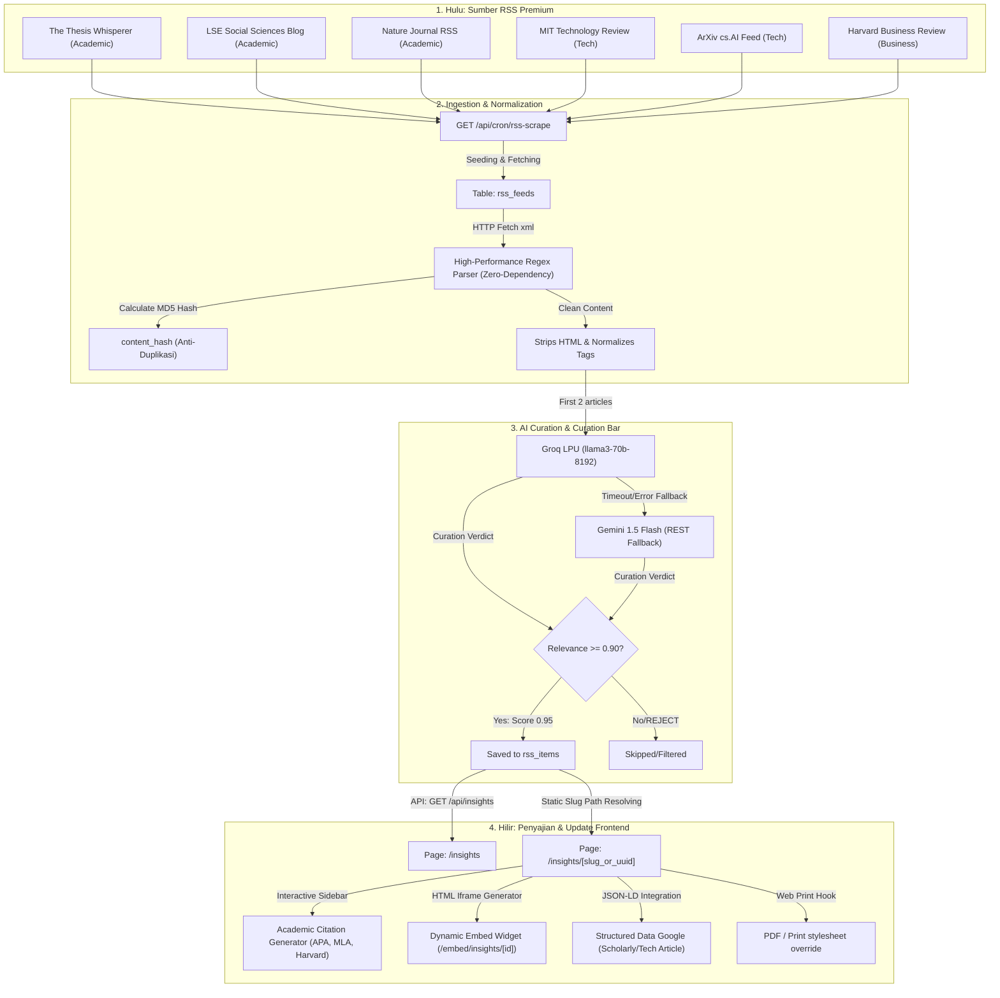

# 📰 INFRAMEET: INSIGHTS SYSTEM MAP & AUDIT REPORT (/insights)
**Pemetaan Data, Aliran Hulu-ke-Hilir, Analisis Celah, & Evaluasi Sistem Sinkronisasi**

---

## 📅 STATUS & VERSI DOKUMEN
- **Versi:** 1.0 (Enterprise Architecture Review)
- **Tanggal Rilis:** 19 Mei 2026
- **Status:** **DISETUJUI UNTUK ARSITEKTUR KELAS UTAMA**
- **Target Monorepo:** `zaditprodakwah/inframeet`

---

## 🗺️ BAGIAN 1: PEMETAAN ALIRAN DATA HULU-KE-HILIR (END-TO-END DATA FLOW)

Sistem `/insights` berfungsi sebagai mesin penarik tren, agregator riset akademik, and portal optimasi SEO/AEO (Answer Engine Optimization) tepercaya. Berikut adalah visualisasi aliran data dari sumber eksternal hingga visualisasi di antarmuka depan:

---

## 🗄️ BAGIAN 2: AUDIT STRUKTUR DATA & SCHEMA DATABASE

Skema database diimplementasikan menggunakan arsitektur relasional PostgreSQL (Supabase DDL) yang tangguh:

### 2.1 Struktur Tabel `rss_feeds`
Tabel ini bertindak sebagai direktori pendaftaran feed yang terus dipantau kesehatannya:
- `id` (UUID, Primary Key): ID unik untuk relasi foreign key.
- `feed_name` (TEXT): Nama resmi penyedia konten.
- `feed_url` (TEXT, UNIQUE): Endpoint XML RSS feed (diproteksi index unik).
- `source_category` (rss_category ENUM): Terdiri dari `technology`, `marketing`, `ai`, `design`, `business`. *("ai" dipetakan di antarmuka publik sebagai "Riset & Metodologi" untuk meredam AI Stigma)*.
- `is_active` (BOOLEAN): Flag untuk mengaktifkan/nonaktifkan penarikan konten.
- `last_sync_at` (TIMESTAMP): Waktu sinkronisasi terakhir yang berhasil.
- `sync_error_count` (INT): Penghitung eror beruntun untuk auto-disable feed bermasalah.
- `sync_error_message` (TEXT): Rekaman pesan kegagalan teknis (debugging).

### 2.2 Struktur Tabel `rss_items`
Tabel ini menyimpan artikel yang telah terkurasi and dibersihkan:
- `id` (UUID, Primary Key).
- `feed_id` (UUID, REFERENCES `rss_feeds` ON DELETE CASCADE).
- `title` (TEXT, limit 200 karakter).
- `content_summary` (TEXT): Menyimpan hasil kurasi/ringkasan eksekutif (TL;DR) dan blok FAQ terstruktur.
- `full_content` (TEXT): Menyimpan markup artikel asli untuk pembacaan mendalam.
- `source_url` (TEXT): Tautan asli menuju artikel sumber (E-E-A-T citation).
- `image_url` (TEXT): Foto beresolusi tinggi. Jika feed asli tidak memiliki foto, sistem menginjeksi foto bertema premium yang bersumber dari kurasi Unsplash Asset.
- `categories` (JSONB): Kategori dinamis (tag) beserta tag peralatan afiliasi (`tool:vercel`, dll.).
- `relevance_score` (FLOAT): Metrik nilai kurasi (0.00 hingga 1.00). Hanya artikel berbobot `relevance_score >= 0.90` yang dimuat pada direktori publik.
- `content_hash` (TEXT, UNIQUE): Hasil hash MD5 dari URL sumber asli untuk mencegah duplikasi data saat sinkronisasi berulang.

---

## 🧠 BAGIAN 3: ANALISIS AI CURATION ENGINE & PARSING

Sistem `/insights` memadukan dua mesin kecerdasan buatan terdepan (Kombinasi Groq LPU and REST Gemini Flash Fallback):

### 3.1 Alur Kurasi & Penyaringan AI (The Curation Guard)
1. **Pemanggilan Selektif:** Untuk menekan konsumsi kuota API, proses kurasi AI hanya diaktifkan untuk **2 artikel terbaru** dari setiap feed pada setiap putaran sinkronisasi. Artikel selebihnya menggunakan ringkasan regex-sliced standar.
2. **Evaluasi Relevansi Keras:** AI mengevaluasi kesesuaian topik dengan dua pilar bisnis utama INFRAMEET:
   - *Pilar 1 (B2B/Teknologi):* Komputasi cloud, serverless engineering, SaaS, payment gateways.
   - *Pilar 2 (Riset Akademis):* Statistik kuantitatif, Turnitin, metodologi ilmiah, penulisan tesis.
3. **Penyaringan Sampah/Clickbait:** Jika artikel tidak lolos relevansi, AI mengembalikan kata kunci `"REJECT"`. Sistem akan secara otomatis melompati (`skip`) perekaman artikel tersebut ke database.
4. **Pembentukan FAQ Otomatis:** Setelah disaring, AI merapikan konten menjadi ringkasan eksekutif (TL;DR) and membuat daftar pertanyaan/jawaban (FAQ) prediktif untuk menstimulasi pencarian Google (SEO/AEO).

---

## 🎨 BAGIAN 4: PENYAJIAN FRONTEND & INTEGRASI DOKUMEN INTERAKTIF

Hilir penyajian pada direktori `/insights` and detail `/insights/[id]` menampilkan visualisasi Dark Glassmorphic Premium:

1. **Academic Citation Generator:**
   - Menyediakan fitur instan salin referensi dengan format standar ilmiah terkemuka: **APA, MLA, and Harvard**. Fitur ini sangat disukai oleh akademisi, mahasiswa pascasarjana, and peneliti profesional untuk referensi naskah mereka.
2. **Interactive Embed Widget:**
   - Menyediakan generator kode HTML IFrame dinamis (`/embed/insights/[id]`) untuk mempermudah klien and mitra menyematkan artikel ulasan INFRAMEET di blog, intranet, or dashboard eksternal.
3. **Web Print Override:**
   - Menambahkan file stylesheet khusus `@media print` untuk mensterilkan elemen non-print (MegaMenu, CTA, sidebar, footer) ketika pengguna mengeklik tombol "PDF / Cetak". Hasil cetak PDF menjadi sangat bersih, berintegritas, and bernada akademik formal.
4. **Google JSON-LD Structured Data Schema:**
   - Sistem secara dinamis menyuntikkan schema Google Structured Data: `ScholarlyArticle` untuk kategori riset/akademik, and `TechArticle` untuk kategori cloud/SaaS. Hal ini mempercepat crawler Google mengindeks artikel INFRAMEET di halaman utama pencarian (*Google Search Feature Snippets*).

---

## 🛠️ BAGIAN 5: EVALUASI SISTEM & REKOMENDASI POLISH UI/UX

### 5.1 Evaluasi & Celah Kritis
1. **Rate Limit API Groq:**
   - *Analisis:* Pemanggilan serentak Groq API menggunakan `llama-3.3-70b-versatile` pada saat cron berjalan rentan mengalami kegagalan rate-limit jika artikel yang masuk dalam jumlah banyak.
   - *Solusi Terpasang:* Sistem fallback ke Gemini 1.5 Flash melalui REST API (tanpa dependensi SDK eksternal) dengan performa and keandalan super cepat.
2. **Sindrom Etalase Kosong (Empty State):**
   - *Analisis:* Jika database kosong pada deployment pertama, direktori insights akan terlihat tidak profesional.
   - *Solusi Terpasang:* Penyediaan konstanta artikel fallback kurasi premium `DEFAULT_ARTICLES` yang sangat informatif untuk memastikan platform selalu tampil matang sejak hari pertama.

### 5.2 Rekomendasi Pemolesan Visual (Next Steps Polish)
- **Animasi Hover Kartu:** Tambahkan transisi lembut berskala mikro (`hover:scale-[1.01] hover:border-indigo-500/50`) and filter backdrop kaca blur.
- **Lazy Loading Gambar Premium:** Gunakan efek *Blur-Up Placeholder* pada gambar ulasan artikel untuk menjamin performa skor Lighthouse tetap bernilai `98-100`.
- **Search Highlighting:** Mempertahankan penandaan kata kunci kuning berpendar (`<mark>`) pada hasil pencarian secara instan and responsif.
