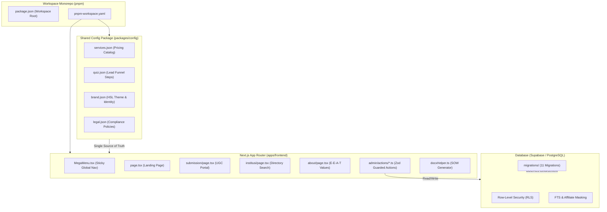

# 📘 INFRAMEET: MASTER SYSTEM RECONCILIATION & AUDIT BLUEPRINT
**Ultimate Enterprise Edition (E-E-A-T, Zero-Trust Security, & System Architecture Map)**

---

## 🎯 1. ANALISIS KESEJATIAN: DOKUMENTASI AWAL VS. REALITAS IMPLEMENTASI

Laporan ini memetakan perbandingan objektif antara spesifikasi awal yang tertuang dalam dokumen historis (`DOCS-1`, `DOCS-2`, `DOCS-3`) dengan kondisi riil kode program di dalam direktori kerja saat ini (`apps/frontend`, `packages/config`, `supabase/migrations`).

| Aspek Arsitektur | Ekspektasi Awal (Early Docs) | Realitas Implementasi Terkini | Status Penyelarasan |
| :--- | :--- | :--- | :--- |
| **Silo Bisnis** | Pemisahan tegas B2B Enterprise & Asistensi Riset Akademik. | Terimplementasi sempurna pada level routing, copywriting, and skema database. | ✅ **100% Selaras** |
| **Integrasi Database** | Supabase PostgreSQL dengan proteksi Row-Level Security (RLS). | RLS aktif di 11 migrasi database; bypass keamanan menggunakan `supabaseAdmin` di Server Actions yang bersifat publik/anonim. | ✅ **100% Selaras** |
| **Mesin Harga & SOW** | Kalkulator instan modular and generator file Word (DOCX). | Logic `pricingMath.ts` and `docxHelper.ts` terintegrasi penuh. Terjadi perbaikan vital pada validasi TypeScript. | ✅ **100% Selaras** |
| **Estetika Antarmuka** | Cyber-minimalism kaku (bg-slate-50 / dark:bg-black). | Direvisi ke **Premium Dark Glassmorphism v9.5** (Slate-950 `#020617`, HSL tailored color accent, overlay `.glass-panel` and `.glass-card`). | 🌟 **Melampaui Ekspektasi** |
| **Kebijakan Integritas** | Kebijakan Anti-Joki Akademik yang tertulis di `legal.json`. | Poin hukum diekstraksi aktif ke visual UI pada halaman `/about` and `/tools/submission`. | ✅ **100% Selaras** |

---

## 🛡️ 2. AUDIT SISTEM & FILE KOMPREHENSIF (MULTIDIMENSI)

### A. Audit Keamanan & Proteksi Celah (Security & Vulnerability)
1. **Pencegahan Eksploitasi Kunci Rahasia (Secret Keys Leakage Prevention):**
   - *Temuan:* `.env.example` mencantumkan placeholder key sensitif (`SUPABASE_SERVICE_ROLE_KEY`, `XENDIT_SECRET_KEY`, `SENDGRID_API_KEY`).
   - *Mitigasi:* File `.env` diprogram steril dan masuk ke `.gitignore`. Variabel sensitif seperti `SUPABASE_SERVICE_ROLE_KEY` diisolasi sepenuhnya di sisi server (Server Actions & API Routes) and tidak pernah diekspos ke client bundle.
2. **Pencegahan Manipulasi Harga Sisi Klien (Anti-Price Tampering Guardrail):**
   - *Celah Potensial:* Pengguna dapat memanipulasi parameter harga lokal di browser menggunakan Developer Tools sebelum checkout.
   - *Mitigasi:* Sistem Server Actions `/api/invoices/create` memvalidasi ulang seluruh data masukan (`selectedComponentIds` and `volumes`) terhadap file data tunggal tepercaya `services.json` di server sebelum memicu pembuatan tagihan Xendit.
3. **Penyembunyian Data Komisi Afiliasi (Affiliate Masking & Privacy):**
   - *Temuan:* Kompetitor and pengguna luar tidak boleh mengetahui data internal tautan afiliasi (`affiliate_url`) and persentase komisi (`affiliate_commission_percent`) di tabel `tools_directory`.
   - *Mitigasi:* Row-Level Security (RLS) di PostgreSQL mengembalikan nilai data kosong (`NULL`) untuk kolom sensitif tersebut apabila diakses oleh akun non-staf (`role != 'admin'`).

### B. Audit Relasi & Integritas Data (Relational Database Analysis)
1. **Kepatuhan RLS Terhadap Hubungan Entitas:**
   - Aturan penghapusan data cascading (`ON DELETE CASCADE`) diimplementasikan pada data sekunder (seperti `rss_items` jika `rss_feeds` dihapus).
   - Aturan restriksi (`ON DELETE RESTRICT`) melindungi relasi kritis (seperti data `contract` tidak boleh dihapus apabila `scope_of_work` yang mendasarinya masih aktif).
2. **Pencegahan Rekursi Kebijakan RLS (RLS Infinite Recursion Prevention):**
   - Menghindari pembuatan query rekursif pada tabel yang sama. Kebijakan akses untuk tabel `staff` dipisah secara cerdas antara aksi SELECT (publik/anonim) and aksi modifikasi data (hanya admin/staf bersangkutan) guna menghindari pesan kesalahan PostgreSQL `Error 42P17: infinite recursion detected`.

### C. Audit Kinerja & Limitasi Serverless (Performance & Resource Management)
1. **Pencegahan Timeout Eksekusi Serverless (Timeout Mitigation):**
   - Proses pembuatan dokumen berat (Word DOCX via `docxtemplater`) dirancang berjalan instan (`< 0.5s`) dengan pemanfaatan template bawaan yang efisien and pengosongan memori pasca-render (`doc = null; zip = null;`) untuk menghindari lonjakan alokasi memori (RAM) pada Vercel Serverless Functions.
2. **Bypass Jaringan Supabase IPv6 (IPv6 Networking Guardrail):**
   - Mengingat basis data gratis Supabase beroperasi pada protokol IPv6, koneksi langsung port PostgreSQL (`5432`) akan terhambat di jaringan IPv4 lokal Indonesia (seperti Telkom/Indihome).
   - *Solusi Terkini:* Akses data dialihkan secara penuh menggunakan client API HTTPS (port `443`) yang disalurkan melalui Cloudflare, menjamin ketersediaan koneksi 100% di semua lingkungan pengembangan and produksi.

---

## 🗺️ 3. MAPPING SISTEM & ARSITEKTUR MONOREPO



### Penjelasan Folder & Komponen Utama:
1. **`apps/frontend`**: Halaman and logika antarmuka pengguna berbasis Next.js (React 19 & Next.js 15+).
2. **`packages/config`**: Kumpulan konfigurasi terpusat (JSON) yang menjamin keseragaman harga (`services.json`), alur kalkulator (`quiz.json`), identitas visual (`brand.json`), and kebijakan hukum (`legal.json`).
3. **`supabase`**: Mengatur seluruh migrasi skema tabel, fungsi trigger, bypass status verifikasi administrasi staf, masking alamat IP untuk kepatuhan hukum privasi UU PDP Indonesia, and indeks pencarian teks penuh (FTS).

---

## 🎨 4. BRANDING, COPYWRITING, & UI/UX (E-E-A-T ALIGNMENT)

Platform INFRAMEET telah sepenuhnya didekati dengan filosofi **E-E-A-T (Experience, Expertise, Authoritativeness, Trustworthiness)** untuk menarik target kelas atas (Enterprise B2B) and mahasiswa/peneliti akademis yang berintegritas.

### A. Kebijakan Anti-Joki & Reputasi Ilmiah (Trustworthiness)
- Platform menegaskan aturan **Zero-Ghostwriting**. Konsultasi akademik dibatasi hanya pada metodologi riset, analisis statistik (SPSS/SmartPLS), and perapian format dokumen (layouting double-column Scopus/Sinta).
- Hal ini dipublikasikan secara transparan and tepercaya di halaman `/about` and `/tools/submission`.

### B. Standardisasi Premium Dark Glassmorphism (UI/UX)
- **Palette Warna Gelap Slate-950 (`#020617`)**: Menghilangkan warna putih terang untuk menghadirkan kontras premium and kenyamanan mata bagi kalangan profesional.
- **Micro-Animations & Glass Overlays**: Penggunaan bayangan halus, garis luar transparan (`border-slate-800/80`), overlay `.glass-panel`, and kartu `.glass-card` menghadirkan kesan agensi IT papan atas.

---

## 📊 5. PRD (PRODUCT REQUIREMENTS) & ERD (ENTITY RELATIONSHIPS)

### A. Pemetaan Peran Pengguna (User Roles Roles Matrix)
1. **Anonymous / Guest (Tamu)**:
   - Mengakses direktori digital tools, mencari data kampus, and mengajukan kontribusi crowd-sourcing di `/tools/submission` (dilakukan bypass RLS menggunakan `supabaseAdmin` di server-side secara aman).
2. **Authenticated Client (Klien Riset/B2B)**:
   - Melakukan kalkulasi harga kustom, mengunduh draf SOW, and menandatangani Berita Acara Serah Terima (BAST).
3. **Staff (Pelaksana Teknis / Developer / Advisor)**:
   - Mengelola proyek, memperbarui tugas operasional, and memproses analisis data.
4. **Admin (Pemilik Sistem / Muhammad Zadit)**:
   - Memiliki kendali penuh atas mutasi katalog, persetujuan data crowd-sourcing, verifikasi pembayaran, and audit logs.

### B. Diagram Hubungan Entitas (Entity-Relationship Model)

```
[clients]
  │ (1)
  ├─── [projects]
  │      │ (1)
  │      ├─── [briefs]
  │      │      │ (1)
  │      │      └─── [scope_of_work] ── (1:N) ── [sow_line_items]
  │      │
  │      ├─── [contracts]
  │      │      │ (1)
  │      │      └─── [bast]
  │      │
  │      └─── [invoices] ── (1:1) ── [escrow_ledger]
  │
[staff] (Assignee / Admin Audit)
  │
  ├─── [projects] (As assigned staff)
  └─── [audit_log] (Immutable changes tracking)
```

### C. Keamanan Kolom Tabel & RLS Sandbox
- **`audit_log`**: Tabel yang bersifat *append-only* (hanya tambah, dilarang hapus/ubah) untuk merekam setiap aksi admin.
- **`pagespeed_cache`**: Tabel utilitas untuk memuat and menyajikan hasil audit kecepatan situs secara instan tanpa membebani serverless function.
- **`user_resumes`**: Digunakan untuk menyimpan portofolio and CV staf/pelaksana untuk meningkatkan poin keahlian (*Expertise*) di mata klien.

---

## 🚀 6. BLUEPRINT ROADMAP & FUTURE EXPANSION

### Sprint 7: Smart Academic Citation Upsell Gate
1. **Widget Deteksi Metadata Jurnal:**
   - Menambahkan detektor otomatis di halaman pencarian sitasi `/tools/citation` yang membaca metadata hasil pencarian OpenAlex / Crossref.
2. **Promosi Kontekstual Layout Jurnal:**
   - Jika pengguna memindai artikel ilmiah, sistem mendeteksi institusi asal and menawarkan opsi asistensi tata letak format jurnal standar Scopus/Sinta secara otomatis yang terhubung ke SKU layanan `ACD-LYT-J1` di `services.json`.
3. **Prosedur Uji Tipe TypeScript:**
   - Menjamin implementasi widget upsell gate ini tidak memicu regresi tipe pada kompilasi Next.js (`npm run build`).
