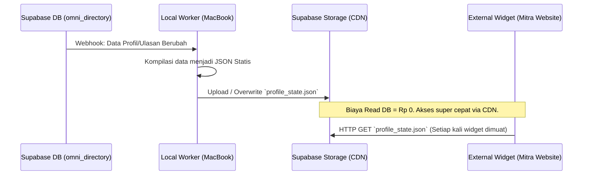

# INFRAMEET2 Addendum 01: Advanced Integration, Active Utilities, & CEO "God Mode" Console

This document specifies the advanced architecture, security bypasses, and distributed zero-database systems that empower the CEO Command Center (God Mode Dashboard) and associated enterprise utilities.

---

## 1. The CEO "God Mode" Console (Rich Admin Dashboard)

The CEO Admin dashboard acts as the platform command center, operating with absolute authority bypassing regular RLS user boundaries via secure database-level hooks.

### 1.1 The 5 Pillars of Control (Dasbor Kuadran & Moderasi)

```
┌───────────────────────────────────────┬───────────────────────────────────────┐
│              KUADRAN 1:               │              KUADRAN 2:               │
│      SYSTEM HEALTH & PULSE            │      ESCROW & FINANCIAL OVERRIDE      │
├───────────────────────────────────────┼───────────────────────────────────────┤
│ • Kill Switch: Global Async Fetch     │ • TVL & Daily Vol Visualizations      │
│   toggles for API outages.            │ • Force Release / Force Refund RPC    │
│ • CDN Monitor: Profile JSON States.   │   overriding dispute blockades.       │
├───────────────────────────────────────┼───────────────────────────────────────┤
│              KUADRAN 3:               │              KUADRAN 4:               │
│      DATA ARCHIVING & RESTORE         │      GOVERNANCE & TELEMETRY           │
├───────────────────────────────────────┴───────────────────────────────────────┤
│                             PILAR 5 (FULL WIDTH):                             │
│                         PUBLIC UGC SUBMISSIONS QUEUE                          │
├───────────────────────────────────────────────────────────────────────────────┤
│ • Real-Time content moderation loop (insight, case_study, and tool).          │
│ • Approve & Publish dynamic data promotion directly into live database tables. │
└───────────────────────────────────────────────────────────────────────────────┘
```

#### Kuadran 1: System Health & Integration Pulse
*   **Visual Analytics:** Real-time API reachability trackers for ROR, OpenAlex, and Kemdikbud (PDDikti).
*   **Advanced Kill Switch:** A global toggle persisted in the database that instantly suspends external API lookup calls across all client interfaces during downstream outages to avoid client-side hangs (Zero-Downtime Patch).
*   **CDN Monitor:** Tracks static JSON profile structures compiled and synced by the local worker node.

#### Kuadran 2: Escrow & Financial Oversight
*   **Visual Analytics:** Visualizations mapping Total Value Locked (TVL), BAST verification conversion ratios, and transaction values.
*   **Escrow Override:** Founder overrides bypassing dispute blockades:
    *   **Force Release:** Triggers DB-level transitions to `'released'` releasing funds.
    *   **Force Refund:** Triggers transition to `'refunded'` reversing ledger locks.

#### Kuadran 3: Data Archiving & Compliance Engine
*   **Cold Storage:** Visual list of older transactions (> 60 days) archived in Google Drive.
*   **One-Click Restore:** A trigger firing a secure webhook to the Local Worker which fetches, decrypts (using authenticated **AES-256-GCM**), and re-injects the data rows back to the active Supabase tables in seconds.

#### Kuadran 4: Entity Governance & Telemetry
*   **Traffic Heatmap:** Tremor UI visual analytics showcasing the highest referring client sites where embeddable badges/widgets are active.
*   **Manual Suspend/Verify Overrides:** Authorities to suspend fraudulent entities, or manually issue Gold Lencana Verifikasi (Verified Authority) bypassing trust logs.

#### Pilar 5: Public UGC Submissions Queue
*   **Crowd-Sourced Moderation:** A high-fidelity administrative moderation desk mapping incoming community inputs (articles, case studies, academic listings).
*   **Dynamic Data Promotion Engine:** One-click authoritative publishing that migrates and parses draft payloads, promoting them instantly to active tables (`rss_items`, `portfolio_cases`, `tools_directory`) with live sitemaps.

---

### 1.2 "God Mode" Database Core Bypass

Admin-level operations are guarded securely at the PostgreSQL database level using Custom JWT Claims.

```sql
-- Deteksi Admin sejati melalui Custom JWT Claim
CREATE OR REPLACE FUNCTION auth.is_admin() 
RETURNS BOOLEAN AS $$
  SELECT COALESCE(
    (current_setting('request.jwt.claims', true)::jsonb -> 'app_metadata' -> 'is_admin')::boolean, 
    false
  );
$$ LANGUAGE sql SECURITY DEFINER;

-- Tabel Audit Wajib (Append-Only) untuk setiap aksi "God Mode"
CREATE TABLE admin_audit_logs (
  id UUID PRIMARY KEY DEFAULT gen_random_uuid(),
  admin_id UUID REFERENCES auth.users(id),
  action_type VARCHAR(255) NOT NULL,
  target_id UUID, -- ID Entitas atau Transaksi yang dieksekusi
  executed_at TIMESTAMPTZ DEFAULT NOW()
);

-- RLS Security: Append-only enforcement
ALTER TABLE admin_audit_logs ENABLE ROW LEVEL SECURITY;
CREATE POLICY admin_audit_insert ON admin_audit_logs FOR INSERT WITH CHECK (auth.is_admin());
CREATE POLICY admin_audit_select ON admin_audit_logs FOR SELECT USING (auth.is_admin());
```

---

## 2. Active Functional Utilities (Mitra Embedded Widgets)

Distributed interactive widgets embedded on Partner/Mitra websites that capture leads while displaying reputation.

1.  **Verified Testimonials Carousel:** A Swiper.js review carousel showcasing customer quotes that are guaranteed 100% genuine through cryptographic BAST transaction matches.
2.  **Live Project Stepper (Milestone Tracker):** An interactive milestone progression bar letting clients track active contract progress in real time (held -> BAST uploaded -> released).
3.  **Embeddable Lead Magnets (Micro-Calculators):**
    *   **B2B ROI Calculator:** Interactive financial calculator demonstrating the cost-efficiency gains of using verified partnerships.
    *   **Academic Citation Formatter:** Using `citation-js` to convert raw metadata or DOI entries into clean APA/MLA formatting. The final formatted citation is dispatched via email, automatically registering the visitor as a sales lead.

---

## 3. Zero-Database Query Architecture (CDN Cost Hack)

To scale millions of external widget loads under the Supabase Free Tier, the architecture uses a CDN storage caching loop:



1.  Database edits trigger a Webhook dispatching the change to the Local Worker.
2.  Local Worker compiles the profile details and reviews into a static JSON.
3.  Local Worker overwrites `profile_state.json` inside Supabase Storage (CDN).
4.  Partner website widgets download `profile_state.json` via HTTP GET, ensuring **Rp 0 database read fees**.

---

## 4. Technology Stack Specification

*   **CEO Command UI:** `@tremor/react` or Recharts.
*   **Shadow DOM Embeds:** `@r2wc/react-to-web-component` or native Web Component wrappers.
*   **Reviews Slider:** `swiper`.
*   **Dynamic Lookups:** `@tanstack/react-query` + `usehooks-ts` (500ms debounced hooks).
*   **Citation Engine:** `citation-js`.
*   **Cold Storage Encryption:** Node's native `crypto` module (AES-256-GCM).
*   **Google Drive API:** `googleapis` with Google Service Account (Zero-OAuth headless).
