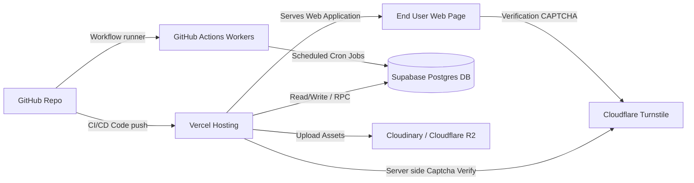

# INFRAMEET - Deployment Architecture

This diagram visualizes our low-cost deployment matrix, which targets Free-Tiers across multiple industry-standard platforms.

```mermaid
graph LR
    GitHub[GitHub Repo] -->|CI/CD Code push| Vercel[Vercel Hosting]
    GitHub -->|Workflow runner| GHA[GitHub Actions Workers]
    
    Vercel -->|Serves Web Application| EndUser[End User Web Page]
    GHA -->|Scheduled Cron Jobs| Supabase[(Supabase Postgres DB)]
    
    Vercel -->|Read/Write / RPC| Supabase
    Vercel -->|Upload Assets| Cloudinary[Cloudinary / Cloudflare R2]
    
    EndUser -->|Verification CAPTCHA| Turnstile[Cloudflare Turnstile]
    Vercel -->|Server side Captcha Verify| Turnstile
```
