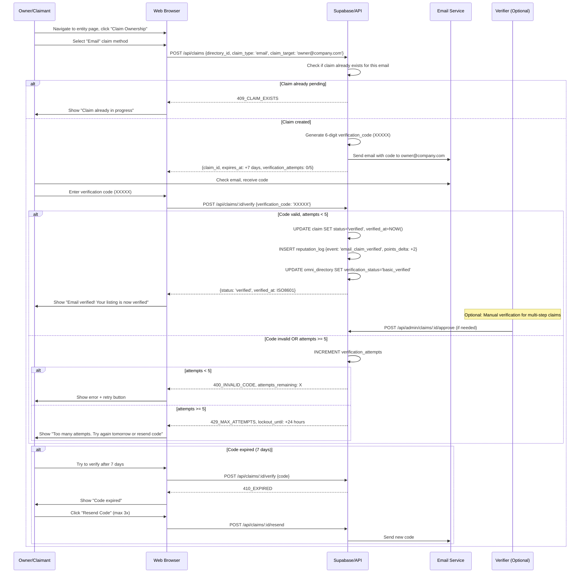
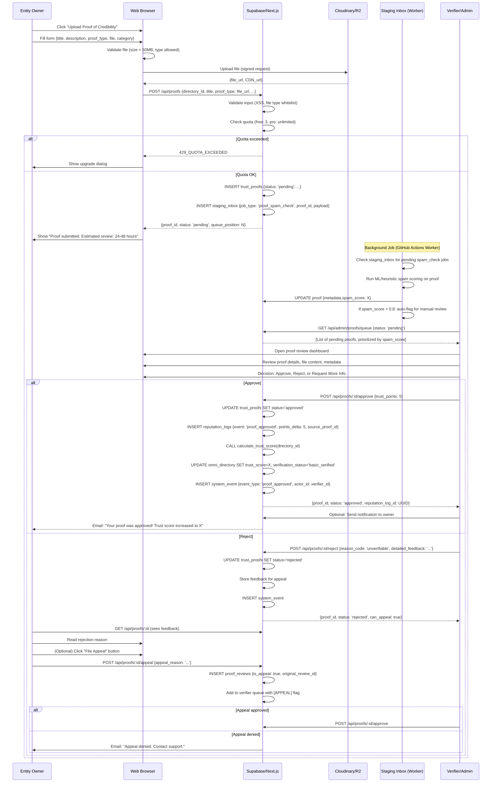
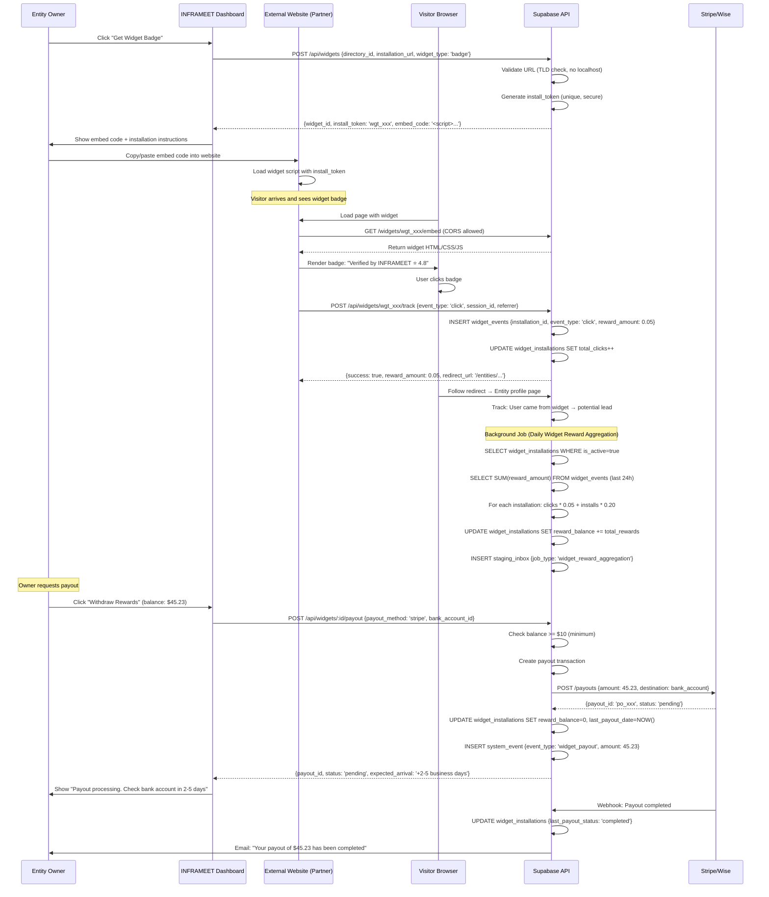
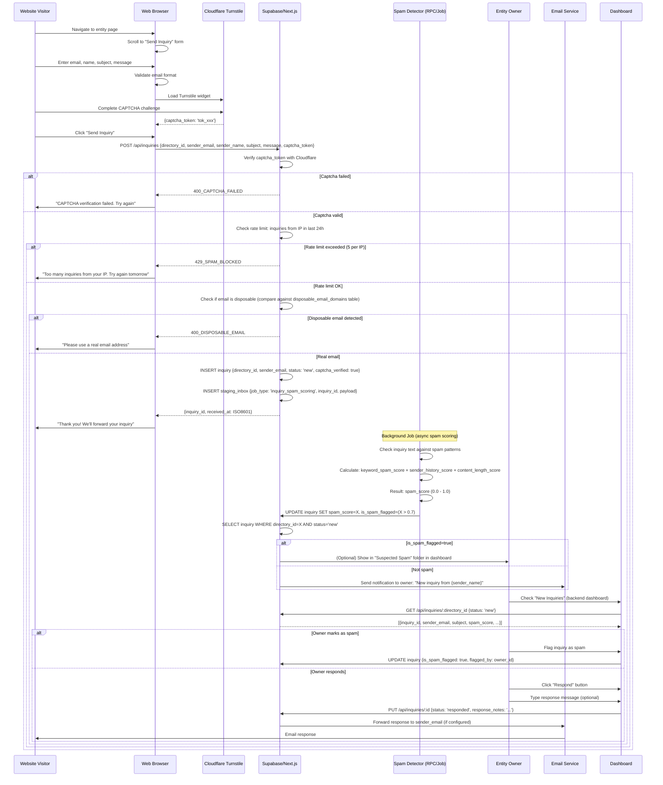
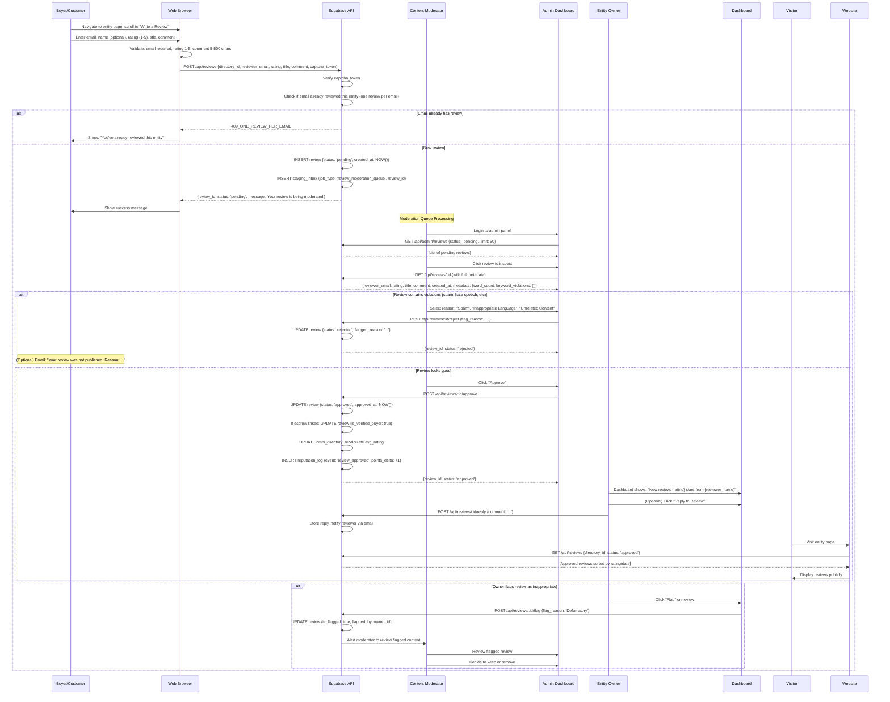

# INFRAMEET - Detailed User Flows

This document details critical user loops, visual diagrams, and frontend/backend transitions.

---
# SECTION 2: CRITICAL USER FLOWS (MERMAID DIAGRAMS)

## 2.1 FLOW: Entity Ownership Claim (Email Verification)

## 2.2 FLOW: Proof Submission → Review → Approval → Trust Update

## 2.3 FLOW: Widget Installation → Click Tracking → Reward Payout

## 2.4 FLOW: Inquiry Submission → Spam Detection → Owner Notification

## 2.5 FLOW: Review Submission → Moderation → Publishing

---

---
