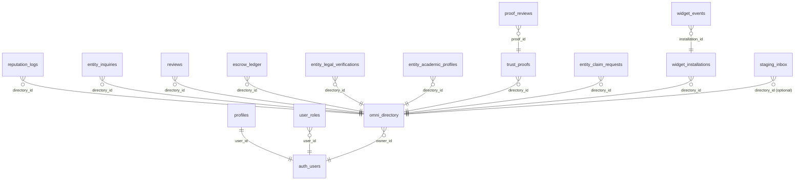

# INFRAMEET - Data Model

## Conceptual Model & Entity Relationships
Below is the definitive Entity-Relationship Diagram (ERD) outlining how core database tables relate to each other.

```mermaid
erDiagram
  profiles ||--|| auth_users : "user_id"
  user_roles }o--|| auth_users : "user_id"

  omni_directory }o--|| auth_users : "owner_id"

  reputation_logs }o--|| omni_directory : "directory_id"
  entity_inquiries }o--|| omni_directory : "directory_id"
  reviews }o--|| omni_directory : "directory_id"
  escrow_ledger }o--|| omni_directory : "directory_id"

  entity_legal_verifications }o--|| omni_directory : "directory_id"
  entity_academic_profiles }o--|| omni_directory : "directory_id"

  trust_proofs }o--|| omni_directory : "directory_id"
  proof_reviews }o--|| trust_proofs : "proof_id"

  entity_claim_requests }o--|| omni_directory : "directory_id"

  widget_installations }o--|| omni_directory : "directory_id"
  widget_events }o--|| widget_installations : "installation_id"

  staging_inbox }o--|| omni_directory : "directory_id (optional)"
```

---
