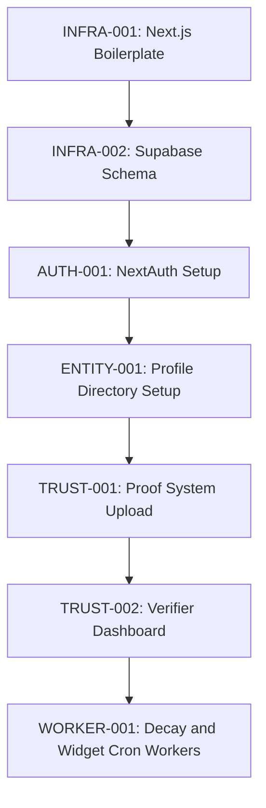

# INFRAMEET - Core System Dependencies Map

A mapping of implementation paths. Components at the top must be finalized before components below are started.

```mermaid
graph TD
    INFRA1[INFRA-001: Next.js Boilerplate] --> INFRA2[INFRA-002: Supabase Schema]
    INFRA2 --> AUTH1[AUTH-001: NextAuth Setup]
    AUTH1 --> ENTITY1[ENTITY-001: Profile Directory Setup]
    ENTITY1 --> TRUST1[TRUST-001: Proof System Upload]
    TRUST1 --> TRUST2[TRUST-002: Verifier Dashboard]
    TRUST2 --> WORKER1[WORKER-001: Decay and Widget Cron Workers]
```
